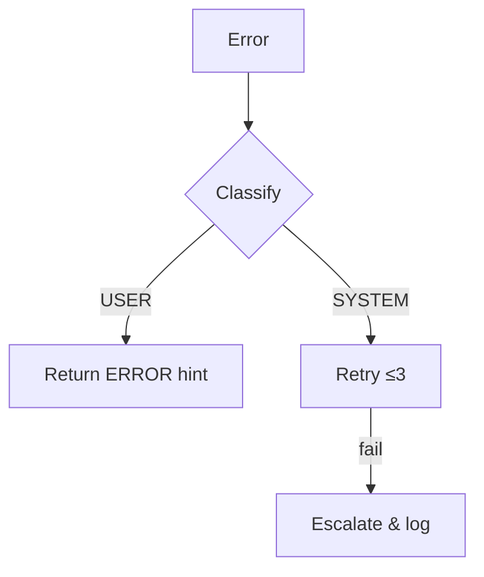

# 0. PURPOSE

Coding agents use this guide as the single source of truth for day-to-day work.
Every normative sentence **MUST**, **SHOULD**, or **AVOID** appears at the start
of a line for easy machine parsing and is assigned a stable ID.

# 1. QUICK-REF CORE PRINCIPLES (CP-\*)

| ID    | Principle (≤ 4 tokens) | MUST/SHOULD | Anti-Token  |
| ----- | ---------------------- | ----------- | ----------- |
| CP-01 | CLARITY_FIRST          | MUST        | vagueness   |
| CP-02 | VALIDATE_INPUT         | MUST        | guesswork   |
| CP-03 | FAIL_SAFE              | MUST        | silent_fail |
| CP-04 | OBSERVABILITY          | MUST        | opaque      |
| CP-05 | SECURITY_PRIVACY       | MUST        | leakage     |
| CP-06 | ACCESSIBLE_I18N        | SHOULD      | en_only     |
| CP-07 | ETHICAL_COMPLY         | MUST        | bias        |
| CP-08 | CONTINUOUS_LEARN       | SHOULD      | stagnate    |
| CP-09 | EMPATHIC_COMMS         | MUST        | hostility   |

# 2. DECISION FLOW

```
Q1: conflicting_directives? → YES → seek_clarification
↓ NO
Q2: missing_data? → YES → ask_user
↓ NO
Q3: involves_coding_task? → YES → check_task_directory
↓ NO
perform_lowest_risk_action
```

## 2.1 Task Management Flow

```
START → ls backlog/tasks/ → select_task → read task file
↓
verify_dependencies → update status "In Progress" → implement
↓
tests_pass? → NO → fix_issues
↓ YES
update status "Done" → create_PR → reference_task_in_PR
```

# 3. UNIVERSAL CONVENTIONS

## 3.1 Naming & Structure (NS-\*)

- **NS-01 MUST** use `lower_snake_case` for files, `UpperCamelCase` for types, `kebab-case` for branches.
- **NS-02 AVOID** suffixes such as `final`, `new`, or `copy`.

```text
branch: feat/42-survey-loader
file:   src/survey/stream_loader.rs
type:   SurveyStreamLoader
```

## 3.2 Code-Comment Discipline (CC-\*)

### 3.2.1 GENERAL PRINCIPLES

- **CC-01 MUST** rely on self-describing code first; add comments only when the
  intent, constraint, or context cannot be gleaned from names, types, or
  structure alone.
- **CC-02 MUST** target one clear audience per comment block:
  `user/caller`, `maintainer/implementer`, or `future-refactorer`.
- **CC-03 MUST NOT** restate information already obvious from the signature,
  module path, or surrounding code.
- **CC-04 SHOULD** keep overall comment density roughly ≤ 10 % of LOC.
- **CC-05 (LANGUAGE PREFIX)** choose the delimiter that is idiomatic for the
  file’s language and stick to it (`//` C/C++/Go/Java/JS, `#` Python/Bash,
  `--` SQL, `<!-- … -->` HTML, etc.). Never mix delimiters in the same file.

### 3.2.2 AIDEV ANCHOR COMMENTS

- **CC-06 (AIDEV-ONLY)** use `AIDEV-TODO:`, `AIDEV-NOTE:`, or
  `AIDEV-QUESTION:` **only** for items that must be revisited in a later
  ticket or before final delivery.
  ```python
  # AIDEV-TODO: add exponential back-off and retry metrics  (T-123)
  ```
- **CC-07 (DROP-IN RULE)** when inserting an `AIDEV-*` anchor, it MUST replace
  any obsolete comment covering the same concern to avoid duplicates.

### 3.2.3 STANDARD COMMENT CATEGORIES

| Category            | Prefix            | When to use                                           |
| ------------------- | ----------------- | ----------------------------------------------------- |
| Documentation       | `///` or `/** */` | Explain public API details not conveyed by signature. |
| Implementation note | `//` or `#`       | Clarify tricky logic, algorithms, or magic constants. |
| Context prose       | multi-line `//`   | Summarise complex setup, address maps, data flow.     |
| TODO (generic)      | `// TODO:`        | Missing feature; code violates stated interface.      |
| XXX (hazard/perf)   | `// XXX:`         | Known correctness/perf risk; code still functions.    |

### 3.2.4 REQUIRED FIELDS FOR TODO / XXX

- **CC-08 MUST** include either:
  1. A ticket/issue ID, **or**
  2. A guard (assertion, flag) that trips when the path is exercised.

### 3.2.5 GOOD vs BAD EXAMPLES

Good — concise & audience-aware

```zig
// Returns next dir entry; buffer overwritten each call.
export fn readdir(dir: _FILE_PROTOCOL) (_FILE_INFO | void | error) = { … }

// FAT32 max filename 256 chars × 2 bytes/char = 512
static let buf: [FILE_INFO_SIZE + 512]u8 = [0...];

assert(ep.send == null);             // TODO: multiple senders  (T-98)

// XXX: O(n) traversal – optimise if profiler flags hot path
```

Bad — redundant or mis-tagged

```c
// AIDEV-TODO: iterate i++          <-- ✘ no follow-up required
for (int i = 0; i < n; i++) { … }

// Adds two numbers                 <-- ✘ obvious from name/signature
int add(int a, int b) { return a + b; }
```

## 3.3 Communication Protocols (CM-\*)

- **CM-01 MUST** start every outbound message with **exactly one** of the
  following prefixes **on its own line**: `ACK`, `CLARIFY`, `RESULT`, or `ERROR`.
- **CM-02 MUST** follow the prefix with a line in the form `task_id: <ID>`.
- **CM-03 MUST** leave one blank line below the header lines before the body.
- **CM-04 MUST NOT** include more than one prefix (e.g., `ACK | CLARIFY`).
- **CM-05 MUST NOT** place the `task_id` on the same line as the prefix.

```text
ACK
task_id: T-042

All unit tests passed.
```

```text
ACK | RESULT task_id: T-042   ←✘ Violates CM-04 & CM-05
All unit tests passed.
```

## 3.4 Error Handling (EH-\*)

| Step  | MUST Action                                             |
| ----- | ------------------------------------------------------- |
| EH-01 | Classify error: `USER`, `SYSTEM`, `EXTERNAL`, `UNKNOWN` |
| EH-02 | Retry idempotent ops (exp. back-off, max 3)             |
| EH-03 | Escalate after final retry                              |



## 3.5 Observability (OB-\*)

- **OB-01 MUST** log in structured JSON Lines.
- **OB-02 MUST** mask PII with `***`.
- **OB-03 SHOULD** rotate logs ≤ 30 days.

```json
{
  "ts": "2025-06-08T09:00:00Z",
  "lvl": "INFO",
  "task": "T-001",
  "msg": "cache hit",
  "hr": 0.93
}
```

## 3.6 Security & Privacy (SP-\*)

- **SP-01 MUST** follow least-privilege.
- **SP-02 MUST** scrub secrets in code, logs, and diffs.
- **SP-03 SHOULD** default to TLS 1.3 and SHA-256.
- **SP-04 MUST** apply mitigation checkpoints:

| Stage   | MUST Check           |
| ------- | -------------------- |
| Input   | `schema_validate`    |
| Process | `safe_parsers`       |
| Output  | `injection_sanitize` |

## 3.7 Testing & KPIs (TS-\*)

| KPI-ID | Target                                           | MUST/SHOULD |
| ------ | ------------------------------------------------ | ----------- |
| TS-01  | ≥ 80 % coverage overall, 100 % on critical paths | MUST        |
| TS-02  | MTTR < 30 min                                    | MUST        |
| TS-03  | Latency P95 domain-defined                       | SHOULD      |

## 3.8 Continuous Learning (CL-\*)

- **CL-01 MUST** emit `CHANGE_REQUEST` messages for spec updates.
- **CL-02 MUST** bump **MAJOR** for breaking changes.
- **CL-03 SHOULD** attach a migration guide.

```
CHANGE_REQUEST 1.0.0 ▸ drop sync I/O ▸ adopt async streams
```

## 3.9 Accessibility & I18N (AI-\*)

- **AI-01 MUST** provide alt-text for all diagrams.
- **AI-02 SHOULD** externalise UI strings (`locale/en.yml`).
- **AI-03 MUST** meet WCAG 2.2 AA for web outputs.

## 3.10 Ethics & Bias (EB-\*)

| Risk         | MUST Control            | KPI             |
| ------------ | ----------------------- | --------------- |
| bias         | representative_test_set | ≤ 5 % disparity |
| privacy      | differential_privacy    | anonymised      |
| transparency | source_links            | 100 %           |

## 3.11 Safe-Deployment Guard-Rails (SV-\*)

- **SV-01 MUST** perform a _verification phase_ using **only** non-destructive
  commands listed in `kilo-code.allowedCommands` (see appendix) **before**
  proposing or executing any state-altering operation.
- **SV-02 MUST** include the diff / plan / lint output in the reply under a
  `VERIFICATION` heading so reviewers can inspect the changes.
- **SV-03 MUST** end the verification reply with an explicit confirmation
  request, e.g.
  `“Proceed with deployment? (reply ACK to continue or CLARIFY / ERROR)”`.
- **SV-04 MUST NOT** combine verification and deployment in the same message;
  a separate, follow-up message after approval handles deployment.
- **SV-05 MUST** refuse (reply **ERROR**) if any required non-destructive
  command is _not_ present in `kilo-code.allowedCommands`.
- **SV-06 SHOULD** follow this order of operations:
  `format / lint → diff / plan → validate / test → user approval → deploy`.

Verified-only command examples (non-destructive)

```
terragrunt plan
terraform plan
pulumi preview
helm upgrade --dry-run --debug
kubectl diff -k
argocd app diff
```

Destructive command examples (require explicit approval)

```
terraform apply
pulumi up
helm upgrade
kubectl apply -k
```

### Appendix A – Non-Destructive Command Allow-List

The commands below are classified as _verification-only_; they **MUST NOT**
change cloud resources or mutate state. Agents rely on this list for SV-01.

```text
argocd app diff
argocd app get
argocd app history
argocd app list
argocd app sync --dry-run
aws cloudformation validate-template
backlog board
backlog task create
backlog task edit
backlog task list
backlog task show
aws configure get
aws configure list
aws ec2 describe-instances
aws lambda list-functions
aws s3 ls
aws sts get-caller-identity
black .
black --check .
cat
cdk context
cdk diff
cdk doctor
cdk ls
cdk synth
cdk version
curl -I
df -h
eslint .
find
flake8
free -m
git add
git branch -v
git checkout
git commit
git diff
git grep
git log
git remote -v
git remote show origin
git show
git status
git stash save
helm get all
helm get manifest
helm get values
helm history
helm list
helm lint
helm status
helm template
helm upgrade --dry-run --debug
ifconfig
ip addr show
jest
k9s --readonly
kubectl api-resources
kubectl apply --dry-run=server
kubectl apply --dry-run=server -k
kubectl auth can-i
kubectl cluster-info
kubectl config view
kubectl describe
kubectl diff
kubectl diff -k
kubectl explain
kubectl get
kubectl kustomize
kubectl logs
kustomize build
ls
mkdir
mypy
netstat -plnt
npm audit
npm install
npm list
npm outdated
npm run build
npm test
pip freeze
pip install -r requirements.txt
pip list
pip --version
prettier --check .
prettier --write .
pulumi config
pulumi login
pulumi preview
pulumi stack
pulumi stack export
pulumi stack output
pulumi version
pytest
pwd
tail -f
head -n
touch
terraform fmt
terragrunt fmt
terraform output
terragrunt output
terraform plan
terragrunt plan
terraform providers
terragrunt providers
terraform show
terragrunt show
terraform state list
terragrunt state list
terraform state pull
terragrunt state pull
terraform validate
terragrunt validate
tsc
tsc --noEmit
uname -a
whoami
ping
```

# 4. FILE-BASED TASK MANAGEMENT (TM-\*)

<!-- TOOL-SPECIFIC INTEGRATION START -->
<!-- When backlog.md CLI is available, agents may use these commands:
backlog board, backlog task create/edit/show/list
Remove this section if using a different task management system -->
<!-- TOOL-SPECIFIC INTEGRATION END -->

## Quick Reference Card

```
Task Directory: backlog/tasks/
File Format: task-[id] - [title].md
Statuses: "To Do" → "In Progress" → "Done"
Max In Progress: 1 per agent

Required Sections:
- Description (what to implement)
- Acceptance Criteria (definition of done)
- Session History (timestamped work log)
- Decisions Made (key choices & rationale)
- Files Modified (tracking changes)
- Blockers (issues encountered)
- Next Steps (continuity planning)

Communication Format:
ACK/CLARIFY/RESULT/ERROR
task_id: task-123
[blank line]
[message content]
```

## 4.1 Task File Structure & Format

- **TM-01 MUST** maintain tasks in `backlog/tasks/` directory
- **TM-02 MUST** name task files as: `task-[id] - [title].md` (e.g., `task-123 - Implement user auth.md`)
- **TM-03 MUST** use YAML frontmatter for metadata and markdown for content

### Required File Format:

```markdown
id: task-123
title: "Implement user authentication"
status: "To Do" # Valid: "To Do", "In Progress", "Done"
depends_on: ["task-120", "task-121"] # Optional
created: 2025-01-07
updated: 2025-01-07

## Description

Add OAuth2 login flow with Google and GitHub providers.

## Acceptance Criteria

- [ ] Google OAuth integration
- [ ] GitHub OAuth integration
- [ ] Session management
- [ ] Logout functionality

## Session History

<!-- Update as work progresses -->

## Decisions Made

<!-- Document key implementation decisions -->

## Files Modified

<!-- Track all file changes -->

## Blockers

<!-- Document any blockers encountered -->

## Next Steps

<!-- Maintain continuity between sessions -->

## Notes

- Consider using passport.js for OAuth
- Security review required before deployment
```

## 4.2 Task Lifecycle Management

- **TM-04 MUST** follow status progression: "To Do" → "In Progress" → "Done"
- **TM-05 MUST** update task file immediately when transitioning status
- **TM-06 MUST NOT** have more than one task "In Progress" per agent
- **TM-07 MUST** read existing tasks from `backlog/tasks/` before creating new ones

### Status Transition Process:

```bash
# 1. Check available tasks
ls backlog/tasks/ | grep "To Do"

# 2. Read task details
cat "backlog/tasks/task-123 - Implement user auth.md"

# 3. Update status to In Progress (manually edit file or use tool if available)
# 4. Complete work
# 5. Update status to Done
```

## 4.3 Task Creation Guidelines

- **TM-08 MUST** use descriptive titles (verb + noun): "Implement X", "Fix Y", "Refactor Z"
- **TM-09 MUST** include clear description and acceptance criteria
- **TM-10 MUST** use sequential task IDs (task-1, task-2, etc.)
- **TM-11 SHOULD** include dependencies in frontmatter when applicable

### Task ID Mapping (for migrations):

- Simple IDs (01, 02) → task-1, task-2
- Letter suffix (08A, 08B) → task-9, task-10
- Hyphenated (09-A, 10-B) → task-19, task-20

## 4.4 Dependency Management

- **TM-12 MUST** list dependencies in YAML frontmatter `depends_on` field
- **TM-13 MUST** verify all dependencies are "Done" before starting work
- **TM-14 SHOULD** add cross-phase dependencies where logical

## 4.5 Tool Integration Guidelines

- **TM-15 SHOULD** use backlog.md CLI when available for convenience
- **TM-16 MUST** always be able to work directly with task files
- **TM-17 MUST** ensure file format remains tool-agnostic

### When backlog.md is available:

```bash
# Preferred: Use CLI for convenience
backlog task create "title" -d "description" -s "To Do"
backlog board

# Fallback: Direct file manipulation always works
d: task-124
title: \"New feature\"
status: \"To Do\"
``

## 4.6 Agent Communication Protocol

- **TM-18 MUST** check task directory before starting work
- **TM-19 MUST** read full task file before implementation
- **TM-20 MUST** include task ID in all related communications

### Task Reference Format:

- In messages: `task_id: task-123`
- In commits: `task-123: Description`
- In PR titles: `[task-123] Description`
- In branches: `feat/task-123-description`

### Process Enforcement Examples

#### Start of Every Conversation
```

ACK
task_id: none

Checking backlog/tasks/ directory for current state...
Found 3 tasks in "To Do", 1 task "In Progress", 5 tasks "Done".
Task-42 is currently "In Progress" - reviewing status.

```
#### When Starting Work
```

ACK\
task_id: task-123

Found task-123 in "To Do" status. Updating to "In Progress".
Checking dependencies: task-120 (Done), task-121 (Done).
All dependencies met. Beginning implementation.

```
#### When Blocked
```

ERROR
task_id: task-123

Cannot proceed with task-123.
Blocker: Missing OAuth configuration file.
Updating task file with blocker information.
Need clarification on OAuth provider settings.

```
#### When Completing Work
```

RESULT
task_id: task-123

Task completed successfully.

- Implemented OAuth with Google and GitHub
- All tests passing (15/15)
- Coverage at 92%
  Updating task status to "Done".
  Ready for PR creation.

````
## 4.7 Configuration File

- **TM-21 MUST** respect `backlog/config.yml` if present
- **TM-22 SHOULD** use configured statuses and workflows

### Example config.yml:

```yaml
name: "Project Name"
description: "Project description"
version: 1
statuses: ["To Do", "In Progress", "Done"]
````

## 4.8 State Tracking in Task Files

- **TM-23 MUST** maintain session history within task files
- **TM-24 MUST** document all decisions and blockers in task files
- **TM-25 MUST** track files modified during implementation

### Required State Tracking Sections

Add these sections to task files as work progresses:

```markdown
d: task-123
title: "Implement user authentication"
status: "In Progress"
depends_on: ["task-120", "task-121"]
created: 2025-01-07
updated: 2025-01-07

## Description

[Original description]

## Session History

- 2025-01-07 10:00: Agent started work
- 2025-01-07 10:30: Implemented base authentication
- 2025-01-07 11:00: Added Google OAuth
- 2025-01-07 11:30: Blocked on GitHub OAuth config

## Decisions Made

- Used passport.js for OAuth implementation
- Chose Redis for session storage
- Implemented 15-minute session timeout

## Files Modified

- src/auth/oauth.ts (created)
- src/auth/session.ts (created)
- tests/auth/oauth.test.ts (created)
- package.json (added passport dependencies)

## Blockers

- Missing GitHub OAuth credentials in environment
- Need clarification on session timeout requirements

## Next Steps

- Configure GitHub OAuth credentials
- Add logout endpoint
- Implement session refresh mechanism
```

### State Persistence Guidelines

- **TM-26 MUST** update session history with timestamp for each work session
- **TM-27 MUST** document key decisions with rationale
- **TM-28 MUST** list all files created or modified
- **TM-29 SHOULD** include blockers and their resolution status
- **TM-30 SHOULD** maintain next steps for task continuity

## 4.9 Error Recovery

- **TM-31 MUST** preserve task files during errors (no data loss)
- **TM-32 MUST** handle missing directories gracefully (create if needed)
- **TM-33 SHOULD** validate YAML frontmatter before saving
- **TM-34 MUST** document errors in task file before using ERROR prefix

# 5. PULL-REQUEST WORKFLOW (PR-\*)

## 5.1 Scope & Structure

- **PR-01 MUST** keep each PR small; one backlog task only.
- **PR-02 SHOULD** split large features into incremental tasks and PRs.
- **PR-03 MUST** protect incomplete functionality behind feature flags.
- **PR-04 MUST** reference backlog task ID in PR title: "[task-123] Add user authentication"

## 5.2 Lifecycle

- **PR-05 MUST** open new PRs as **Draft**.
- **PR-06 MUST** switch to **Ready for Review** only after a green build.
- **PR-07 SHOULD** invite targeted feedback during Draft if needed.
- **PR-08 MUST** update task file status to "Done" after PR merge (see TM-05).

## 5.3 Template & Checklist

- **PR-09 MUST** follow the repository PR template.
- **PR-10 MUST** complete the checklist (scope, docs, tests, reviewers, guideline compliance).

```
### BACKLOG TASK: task-123
**Description**: …
- **Test Methods**: …
- **Risk Mitigation**: …
- **Additional Information**: …
```

## 5.4 Communication

- **PR-11 MUST** assume reviewers lack full context; include links and concise explanations.
- **PR-12 MUST** use respectful, clear language (aligns with CP-09).

## 5.5 Branching & Integration

- **PR-13 MUST** follow trunk-based development.
- **PR-14 SHOULD** avoid long-lived branches; feature flags cover unfinished work.

## 5.6 Testing Discipline

- **PR-15 MUST** follow TDD; write deterministic tests first.
- **PR-16 MUST** fix flaky tests before merge.

## 5.7 Security & Compliance

- **PR-17 MUST** follow secure-coding practices and keep dependencies patched.
- **PR-18 SHOULD** maintain audit trails linking PRs, CI results, and backlog task IDs.

## 5.8 Documentation

- **PR-19 SHOULD** document key decisions and findings in the PR or linked tasks.

# 6. ANTI-PATTERNS (AP-\*) & NON-NEGOTIABLES (NV-\*)

## 6.1 Anti-Patterns

| AP-ID | AVOID Pattern            | Safer Replacement                     |
| ----- | ------------------------ | ------------------------------------- |
| AP-01 | `dataProcessor2Final.js` | `data_processor_v2.js`                |
| AP-02 | "It failed."             | `ERROR:user.validation.missing_field` |
| AP-03 | hard-coded secret        | `vault_fetch("API_KEY")`              |

## 6.2 Non-Negotiables

| NV-ID | MUST NEVER…                       | Instead DO…                                              |
| ----- | --------------------------------- | -------------------------------------------------------- |
| NV-01 | change API contracts              | Introduce additive version (`v2`) or optional fields     |
| NV-02 | alter existing migration files    | Create a new forward migration; run data-integrity tests |
| NV-03 | commit secrets                    | Pull from a secrets manager or environment variables     |
| NV-04 | guess business logic              | Ask clarifying questions via `CLARIFY` message           |
| NV-05 | delete or downgrade AIDEV-… notes | Keep them; update the text if outdated                   |

# 7. STYLE & TONE GUIDELINES (ST-\*)

- **ST-01 MUST** be concise; prefer short, active sentences.
- **ST-02 MUST** use Nonviolent Communication (observe-feel-need-request) when giving feedback.
- **ST-03 SHOULD** include examples when clarification aids understanding.

# 8. CHANGELOG TEMPLATE

```
## [X.Y.Z] – YYYY-MM-DD
### Added
-
### Changed
-
### Deprecated
-
### Fixed
-
### Security
-
```

# 9. ARCHIVAL & AUDIT (AR-\*)

1. **AR-01 MUST** tag & sign every release (`git tag -s vX.Y.Z`).
2. **AR-02 MUST** store decision logs under `/.audit/YYYY/MM/`.
3. **AR-03 SHOULD** publish JSON Schema for external auditors.

# 10. TERRAFORM STANDARDS (TF-\*)

All universal conventions apply unless explicitly overridden.

## 10.1 Versioning & Dependencies (TF-VD-\*)

- **TF-VD-01 MUST** pin exact module versions.
- **TF-VD-02 MUST** specify a minimum provider version.
- **TF-VD-03 MUST** define a required CLI version range.

```hcl
terraform {
  required_version = ">= 1.0, < 2.0"
}

module "vpc" {
  source  = "terraform-aws-modules/vpc/aws"
  version = "5.5.2"
}

provider "aws" {
  version = ">= 5.31.0"
}
```

## 10.2 Naming & Structure (TF-NS-\*)

- **TF-NS-01 MUST** use `lower_snake_case` for all resource and variable names.
- **TF-NS-02 SHOULD** keep related resources in a single cohesive module.
- **TF-NS-03 AVOID** mixing unrelated components in one module.

## 10.3 Variables & Outputs (TF-VO-\*)

- **TF-VO-01 MUST** provide a description for every variable and output.
- **TF-VO-02 MUST** declare sensitive variables with `sensitive = true` and **no default**.
- **TF-VO-03 MUST NEVER** output sensitive data unless `sensitive = true`.
- **TF-VO-04 SHOULD** supply sane defaults for optional values.

```hcl
variable "db_password" {
  description = "Database administrator password."
  type        = string
  sensitive   = true
}

output "db_instance_address" {
  description = "The connection endpoint for the database."
  value       = aws_db_instance.this.address
}

output "db_instance_password" {
  description = "The DB admin password."
  value       = aws_db_instance.this.password
  sensitive   = true
}
```

## 10.4 State Management (TF-SM-\*)

- **TF-SM-01 MUST** use a remote backend for state files (with locking).
- **TF-SM-02 MUST** enable versioning & SSE on the state bucket.
- **TF-SM-03 MUST** exclude `.tfstate*` and plans from VCS.

```hcl
terraform {
  backend "s3" {
    bucket         = "my-secure-terraform-state-bucket"
    key            = "global/s3/terraform.tfstate"
    region         = "us-east-1"
    encrypt        = true
    dynamodb_table = "my-terraform-state-lock-table"
  }
}
```

## 10.5 Formatting & Readability (TF-FR-\*)

- **TF-FR-01 MUST** run `terraform fmt`.
- **TF-FR-02 SHOULD** prefer `jsonencode` / `yamlencode` over HEREDOC for large policies.
- **TF-FR-03 MUST** use `#` for comments.

```hcl
resource "aws_iam_policy" "good_policy" {
  name   = "good-policy"
  policy = jsonencode({
    Version   = "2012-10-17"
    Statement = [{
      Effect   = "Allow"
      Action   = "s3:GetObject"
      Resource = "arn:aws:s3:::my-bucket/*"
    }]
  })
}
```
