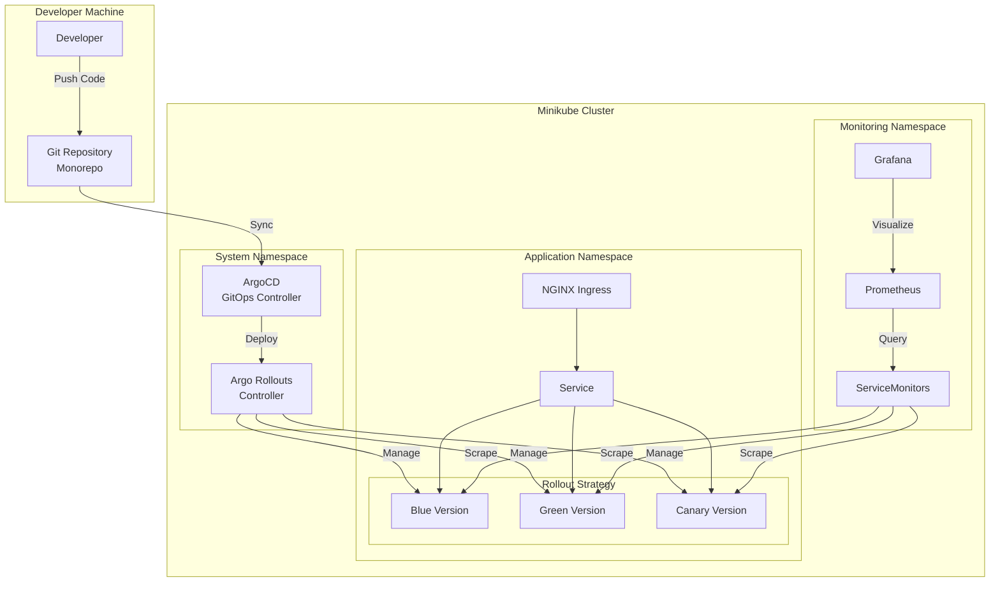

# K8s Observable Rollouts - Architecture Design

## Project Overview

This project implements a complete GitOps-driven Kubernetes deployment pipeline with progressive delivery strategies and comprehensive observability. Using a monorepo approach, we'll build a FastAPI sample application deployed through ArgoCD with Argo Rollouts for blue/green and canary deployments, monitored by Prometheus and Grafana.

## Architecture Components

### Core Infrastructure

- **Minikube**: Local Kubernetes cluster with ingress addon enabled
- **NGINX Ingress Controller**: Traffic routing and load balancing

### GitOps & Deployment

- **ArgoCD**: GitOps continuous delivery controller
- **Argo Rollouts**: Progressive delivery with blue/green and canary strategies
- **Helm**: Application packaging and templating

### Observability Stack

- **Prometheus**: Metrics collection and storage
- **Grafana**: Visualization and dashboards
- **kube-prometheus-stack**: Pre-configured monitoring stack

### Sample Application

- **FastAPI**: Python web framework with async support
- **Endpoints**:
  - `/` - Landing page with application info
  - `/health` - Kubernetes health checks (liveness/readiness)
  - `/slow` - Simulated latency endpoint for testing
  - `/version` - JSON API with version details
  - `/html` - HTML page showing deployment information

## System Architecture Diagram



## Repository Structure

```
k8s-observable-rollouts/
├── README.md
├── Makefile                         # Automation commands
├── .gitignore
├── docs/
│   ├── architecture-design.md       # This document
│   ├── deployment-guide.md
│   └── rollout-strategies.md
│
├── infrastructure/                  # Infrastructure setup
│   ├── minikube/
│   │   └── setup.sh                # Minikube initialization
│   ├── argocd/
│   │   ├── values.yaml            # ArgoCD Helm values
│   │   └── applications/          # ArgoCD Application definitions
│   │       ├── app-of-apps.yaml
│   │       ├── sample-app.yaml
│   │       └── monitoring.yaml
│   └── monitoring/
│       ├── values.yaml            # kube-prometheus-stack values
│       ├── dashboards/
│       │   └── app-metrics.json
│       └── alerts/
│           └── app-alerts.yaml
│
├── apps/                           # Application code
│   └── sample-api/
│       ├── Dockerfile
│       ├── requirements.txt
│       ├── app/
│       │   ├── __init__.py
│       │   ├── main.py         # FastAPI application
│       │   ├── config.py
│       │   ├── routes/
│       │   │   ├── health.py
│       │   │   ├── info.py
│       │   │   └── demo.py
│       │   └── templates/
│       │       └── version.html
│       └── tests/
│           └── test_api.py
│
├── charts/                         # Helm charts
│   └── sample-api/
│       ├── Chart.yaml
│       ├── values.yaml
│       ├── values-dev.yaml
│       ├── templates/
│       │   ├── deployment.yaml
│       │   ├── service.yaml
│       │   ├── ingress.yaml
│       │   ├── rollout.yaml    # Argo Rollout resource
│       │   ├── servicemonitor.yaml
│       │   └── configmap.yaml
│       └── rollout-strategies/
│           ├── blue-green.yaml
│           └── canary.yaml
│
└── scripts/                        # Utility scripts
    ├── generate-traffic.sh
    ├── promote-rollout.sh
    └── rollback.sh
```

## Implementation Phases

### Phase 1: Infrastructure Setup

1. Initialize Minikube cluster with appropriate resources
2. Enable necessary addons (ingress, metrics-server)
3. Configure kubectl contexts

### Phase 2: GitOps Foundation

1. Deploy ArgoCD using Helm
2. Configure ArgoCD repositories and credentials
3. Create App-of-Apps pattern for managing deployments

### Phase 3: Sample Application Development

1. Implement FastAPI application with required endpoints
2. Add Prometheus metrics instrumentation
3. Create Dockerfile and optimize for size
4. Write unit and integration tests

### Phase 4: Helm Chart Creation

1. Design flexible Helm chart with rollout support
2. Create environment-specific values files
3. Implement blue/green and canary configurations

### Phase 5: Progressive Delivery Setup

1. Deploy Argo Rollouts controllers
2. Create rollout resources for both strategies
3. Configure analysis templates for canary

### Phase 6: Observability Implementation

1. Deploy kube-prometheus-stack
2. Create ServiceMonitors for application metrics
3. Design Grafana dashboards
4. Configure alerts for failures and SLOs

### Phase 7: Integration and Testing

1. Test blue/green deployments
2. Test canary rollouts with traffic shifting
3. Verify rollback procedures
4. Load test with traffic generation

## Technical Specifications

### FastAPI Application

- **Framework**: FastAPI 0.100+
- **Server**: Uvicorn
- **Metrics**: prometheus-client library
- **Container**: Multi-stage Docker build
- **Health Checks**:
  - Liveness: `/health/live`
  - Readiness: `/health/ready`

### Argo Rollouts Strategies

#### Blue/Green Strategy

```yaml
strategy:
  blueGreen:
    activeService: sample-api-active
    previewService: sample-api-preview
    autoPromotionEnabled: false
    scaleDownDelaySeconds: 30
    prePromotionAnalysis:
      templates:
        - templateName: success-rate
```

#### Canary Strategy

```yaml
strategy:
  canary:
    canaryService: sample-api-canary
    stableService: sample-api-stable
    trafficRouting:
      nginx:
        stableIngress: sample-api
    steps:
      - setWeight: 20
      - pause: { duration: 2m }
      - analysis:
          templates:
            - templateName: success-rate
            - templateName: latency
      - setWeight: 50
      - pause: { duration: 2m }
      - setWeight: 100
```

### Metrics and Monitoring

- **Application Metrics**:
  - Request rate, duration, and errors (RED metrics)
  - Custom business metrics
  - Version info gauge
- **Infrastructure Metrics**:
  - CPU and memory usage
  - Pod restart counts
  - Rollout status and progress
- **Dashboards**:
  - Application overview
  - Rollout progress
  - Error analysis
  - Performance trends

### Security Considerations

1. RBAC configuration for ArgoCD
2. NetworkPolicies for pod communication
3. Secrets management via SealedSecrets (future enhancement)
4. Image scanning in CI/CD pipeline

## Success Criteria

1. Automated GitOps deployments via ArgoCD
2. Successful blue/green deployment with instant rollback
3. Canary deployment with gradual traffic shift
4. Real-time metrics visible in Grafana
5. Automated rollback on failure detection
6. Version information accessible via web UI

## Next Steps

1. Set up development environment
2. Create initial project structure
3. Implement base FastAPI application
4. Configure local Kubernetes cluster
5. Deploy ArgoCD and begin GitOps workflow
