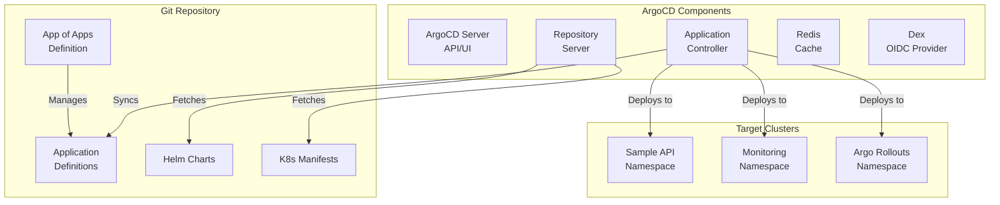

# ArgoCD Deployment and Configuration Strategy

## Overview

This document outlines the deployment strategy for ArgoCD as our GitOps continuous delivery tool. We'll implement the App-of-Apps pattern for managing multiple applications with proper separation of concerns.

## ArgoCD Architecture



## Installation Strategy

### 1. ArgoCD Deployment Script

Create `scripts/deploy-argocd.sh`:

```bash
#!/bin/bash
set -euo pipefail

ARGOCD_VERSION="2.9.3"
ARGOCD_NAMESPACE="argocd"

echo "🚀 Deploying ArgoCD ${ARGOCD_VERSION}..."

# Create namespace
kubectl create namespace ${ARGOCD_NAMESPACE} --dry-run=client -o yaml | kubectl apply -f -

# Add Helm repository
helm repo add argo https://argoproj.github.io/argo-helm
helm repo update

# Install ArgoCD
echo "📦 Installing ArgoCD via Helm..."
helm upgrade --install argocd argo/argo-cd \
    --namespace ${ARGOCD_NAMESPACE} \
    --version ${ARGOCD_VERSION} \
    --values infrastructure/argocd/values.yaml \
    --wait

# Wait for ArgoCD to be ready
echo "⏳ Waiting for ArgoCD components..."
kubectl wait --for=condition=ready pod -l app.kubernetes.io/name=argocd-server -n ${ARGOCD_NAMESPACE} --timeout=300s
kubectl wait --for=condition=ready pod -l app.kubernetes.io/name=argocd-repo-server -n ${ARGOCD_NAMESPACE} --timeout=300s
kubectl wait --for=condition=ready pod -l app.kubernetes.io/name=argocd-application-controller -n ${ARGOCD_NAMESPACE} --timeout=300s

# Apply custom configurations
echo "🔧 Applying custom configurations..."
kubectl apply -f infrastructure/argocd/config/

# Get initial admin password
echo "🔑 Retrieving admin password..."
ARGOCD_PASSWORD=$(kubectl -n ${ARGOCD_NAMESPACE} get secret argocd-initial-admin-secret -o jsonpath="{.data.password}" | base64 -d)

# Install ArgoCD CLI
echo "💻 Installing ArgoCD CLI..."
if ! command -v argocd &> /dev/null; then
    curl -sSL -o /tmp/argocd https://github.com/argoproj/argo-cd/releases/latest/download/argocd-linux-amd64
    sudo chmod +x /tmp/argocd
    sudo mv /tmp/argocd /usr/local/bin/argocd
fi

# Configure ArgoCD CLI
echo "🔧 Configuring ArgoCD CLI..."
argocd login argocd.local --username admin --password "${ARGOCD_PASSWORD}" --insecure

# Deploy App of Apps
echo "🎯 Deploying App of Apps..."
kubectl apply -f infrastructure/argocd/applications/app-of-apps.yaml

echo ""
echo "✅ ArgoCD deployment complete!"
echo ""
echo "📊 Access Information:"
echo "======================"
echo "URL: https://argocd.local"
echo "Username: admin"
echo "Password: ${ARGOCD_PASSWORD}"
echo ""
echo "🔐 Change the admin password with:"
echo "argocd account update-password"
```

### 2. ArgoCD Helm Values

Update `infrastructure/argocd/values.yaml`:

```yaml
## ArgoCD Server
server:
  # Extra arguments
  extraArgs:
    - --insecure # For local development only

  # Ingress configuration
  ingress:
    enabled: true
    ingressClassName: nginx
    hosts:
      - argocd.local
    paths:
      - /
    pathType: Prefix
    annotations:
      nginx.ingress.kubernetes.io/backend-protocol: "HTTPS"
      nginx.ingress.kubernetes.io/force-ssl-redirect: "true"

  # Resource limits
  resources:
    limits:
      cpu: 500m
      memory: 512Mi
    requests:
      cpu: 250m
      memory: 256Mi

  # Metrics
  metrics:
    enabled: true
    serviceMonitor:
      enabled: true
      interval: 30s

## Dex (OIDC Provider)
dex:
  enabled: false # Disabled for local development

## Redis
redis:
  enabled: true
  resources:
    limits:
      cpu: 200m
      memory: 256Mi
    requests:
      cpu: 100m
      memory: 128Mi

## Controller
controller:
  # Enable leader election for HA
  enableLeaderElection: true

  # Resources
  resources:
    limits:
      cpu: 1000m
      memory: 1024Mi
    requests:
      cpu: 500m
      memory: 512Mi

  # Metrics
  metrics:
    enabled: true
    serviceMonitor:
      enabled: true
      interval: 30s

## Repo Server
repoServer:
  # Auto-scaling
  autoscaling:
    enabled: false
    minReplicas: 1
    maxReplicas: 3

  # Resources
  resources:
    limits:
      cpu: 500m
      memory: 512Mi
    requests:
      cpu: 250m
      memory: 256Mi

  # Metrics
  metrics:
    enabled: true
    serviceMonitor:
      enabled: true
      interval: 30s

## ApplicationSet Controller
applicationSet:
  enabled: true
  resources:
    limits:
      cpu: 200m
      memory: 256Mi
    requests:
      cpu: 100m
      memory: 128Mi

## Notifications Controller
notifications:
  enabled: true
  resources:
    limits:
      cpu: 200m
      memory: 256Mi
    requests:
      cpu: 100m
      memory: 128Mi

## Global configurations
global:
  logging:
    level: "info"
    format: "json"

## ConfigMap for ArgoCD settings
configs:
  params:
    # Disable authentication for local development
    server.disable.auth: true
    # Enable insecure mode
    server.insecure: true
    # Application sync options
    application.instanceLabelKey: argocd.argoproj.io/instance
    # Repo server timeout
    timeout.reconciliation: 180s
    # Resource tracking
    application.resourceTrackingMethod: annotation

  # Repository credentials (for private repos)
  repositories:
    - url: https://github.com/your-org/k8s-observable-rollouts
      name: main-repo
      type: git

  # Custom resource definitions
  resource.customizations: |
    argoproj.io/Rollout:
      health.lua: |
        local health_status = {}
        if obj.status ~= nil then
          if obj.status.conditions ~= nil then
            for i, condition in ipairs(obj.status.conditions) do
              if condition.type == "Healthy" and condition.status == "False" then
                health_status.status = "Degraded"
                health_status.message = condition.message
                return health_status
              end
              if condition.type == "Healthy" and condition.status == "True" then
                health_status.status = "Healthy"
                health_status.message = condition.message
              end
            end
          end
        end
        return health_status
```

## App-of-Apps Pattern

### 1. Root Application

Create `infrastructure/argocd/applications/app-of-apps.yaml`:

```yaml
apiVersion: argoproj.io/v1alpha1
kind: Application
metadata:
  name: app-of-apps
  namespace: argocd
  finalizers:
    - resources-finalizer.argocd.argoproj.io
spec:
  project: default
  source:
    repoURL: https://github.com/your-org/k8s-observable-rollouts
    targetRevision: HEAD
    path: infrastructure/argocd/applications
  destination:
    server: https://kubernetes.default.svc
    namespace: argocd
  syncPolicy:
    automated:
      prune: true
      selfHeal: true
      allowEmpty: false
    syncOptions:
      - CreateNamespace=true
    retry:
      limit: 5
      backoff:
        duration: 5s
        factor: 2
        maxDuration: 3m
```

### 2. Application Definitions

Create `infrastructure/argocd/applications/argo-rollouts.yaml`:

```yaml
apiVersion: argoproj.io/v1alpha1
kind: Application
metadata:
  name: argo-rollouts
  namespace: argocd
  finalizers:
    - resources-finalizer.argocd.argoproj.io
spec:
  project: default
  source:
    repoURL: https://argoproj.github.io/argo-helm
    chart: argo-rollouts
    targetRevision: 2.32.5
    helm:
      values: |
        dashboard:
          enabled: true
          ingress:
            enabled: true
            ingressClassName: nginx
            hosts:
              - rollouts.local
        controller:
          metrics:
            enabled: true
            serviceMonitor:
              enabled: true
  destination:
    server: https://kubernetes.default.svc
    namespace: argo-rollouts
  syncPolicy:
    automated:
      prune: true
      selfHeal: true
    syncOptions:
      - CreateNamespace=true
```

Create `infrastructure/argocd/applications/monitoring.yaml`:

```yaml
apiVersion: argoproj.io/v1alpha1
kind: Application
metadata:
  name: monitoring
  namespace: argocd
  finalizers:
    - resources-finalizer.argocd.argoproj.io
spec:
  project: default
  source:
    repoURL: https://github.com/your-org/k8s-observable-rollouts
    targetRevision: HEAD
    path: infrastructure/monitoring
    helm:
      valueFiles:
        - values.yaml
  destination:
    server: https://kubernetes.default.svc
    namespace: monitoring
  syncPolicy:
    automated:
      prune: true
      selfHeal: true
    syncOptions:
      - CreateNamespace=true
      - ServerSideApply=true # For CRDs
```

Create `infrastructure/argocd/applications/sample-app.yaml`:

```yaml
apiVersion: argoproj.io/v1alpha1
kind: Application
metadata:
  name: sample-api
  namespace: argocd
  finalizers:
    - resources-finalizer.argocd.argoproj.io
  annotations:
    # Annotations for notifications
    notifications.argoproj.io/subscribe.on-deployed.slack: deployment
    notifications.argoproj.io/subscribe.on-health-degraded.slack: alerts
    notifications.argoproj.io/subscribe.on-sync-failed.slack: alerts
spec:
  project: default
  source:
    repoURL: https://github.com/your-org/k8s-observable-rollouts
    targetRevision: HEAD
    path: charts/sample-api
    helm:
      valueFiles:
        - values.yaml
        - values-dev.yaml
      parameters:
        - name: image.tag
          value: latest
  destination:
    server: https://kubernetes.default.svc
    namespace: sample-app
  syncPolicy:
    automated:
      prune: true
      selfHeal: true
    syncOptions:
      - CreateNamespace=true
      - PrunePropagationPolicy=foreground
      - PruneLast=true
    retry:
      limit: 5
      backoff:
        duration: 5s
        factor: 2
        maxDuration: 3m
  revisionHistoryLimit: 10
```

## ArgoCD Configuration

### 1. RBAC Configuration

Create `infrastructure/argocd/config/rbac.yaml`:

```yaml
apiVersion: v1
kind: ConfigMap
metadata:
  name: argocd-rbac-cm
  namespace: argocd
data:
  policy.default: role:readonly
  policy.csv: |
    # Admin access
    p, role:admin, applications, *, */*, allow
    p, role:admin, clusters, *, *, allow
    p, role:admin, repositories, *, *, allow

    # Developer access
    p, role:developer, applications, get, */*, allow
    p, role:developer, applications, sync, */*, allow
    p, role:developer, applications, action/*, */*, allow
    p, role:developer, logs, get, */*, allow
    p, role:developer, exec, create, */*, allow

    # Readonly access
    p, role:readonly, applications, get, */*, allow
    p, role:readonly, logs, get, */*, allow

    # Group bindings
    g, argocd-admins, role:admin
    g, developers, role:developer
```

### 2. Project Configuration

Create `infrastructure/argocd/config/projects.yaml`:

```yaml
apiVersion: argoproj.io/v1alpha1
kind: AppProject
metadata:
  name: production
  namespace: argocd
spec:
  description: Production applications
  sourceRepos:
    - "https://github.com/your-org/*"
    - "https://charts.helm.sh/*"
    - "https://argoproj.github.io/*"
    - "https://prometheus-community.github.io/*"
  destinations:
    - namespace: "sample-app"
      server: https://kubernetes.default.svc
    - namespace: "monitoring"
      server: https://kubernetes.default.svc
    - namespace: "argo-rollouts"
      server: https://kubernetes.default.svc
  clusterResourceWhitelist:
    - group: ""
      kind: Namespace
    - group: "apiextensions.k8s.io"
      kind: CustomResourceDefinition
  namespaceResourceWhitelist:
    - group: "*"
      kind: "*"
  roles:
    - name: admin
      policies:
        - p, proj:production:admin, applications, *, production/*, allow
      groups:
        - argocd-admins
    - name: developer
      policies:
        - p, proj:production:developer, applications, get, production/*, allow
        - p, proj:production:developer, applications, sync, production/*, allow
      groups:
        - developers
```

### 3. Notification Configuration

Create `infrastructure/argocd/config/notifications.yaml`:

```yaml
apiVersion: v1
kind: ConfigMap
metadata:
  name: argocd-notifications-cm
  namespace: argocd
data:
  service.webhook.deployment: |
    url: http://webhook-service.default.svc.cluster.local/deployment
    headers:
      - name: Content-Type
        value: application/json

  template.app-deployed: |
    webhook:
      deployment:
        method: POST
        body: |
          {
            "app": "{{.app.metadata.name}}",
            "status": "deployed",
            "revision": "{{.app.status.sync.revision}}",
            "time": "{{.time}}"
          }

  template.app-health-degraded: |
    webhook:
      deployment:
        method: POST
        body: |
          {
            "app": "{{.app.metadata.name}}",
            "status": "degraded",
            "message": "{{.app.status.health.message}}",
            "time": "{{.time}}"
          }

  trigger.on-deployed: |
    - when: app.status.operationState.phase in ['Succeeded'] and app.status.health.status == 'Healthy'
      send: [app-deployed]

  trigger.on-health-degraded: |
    - when: app.status.health.status == 'Degraded'
      send: [app-health-degraded]
```

## GitOps Workflow

### 1. Repository Structure for GitOps

```
k8s-observable-rollouts/
├── .argocd/                    # ArgoCD specific configs
│   ├── config.yaml            # Repository configuration
│   └── kustomization.yaml     # Kustomize patches
├── environments/              # Environment-specific configs
│   ├── dev/
│   │   ├── values.yaml
│   │   └── patches/
│   ├── staging/
│   │   ├── values.yaml
│   │   └── patches/
│   └── prod/
│       ├── values.yaml
│       └── patches/
└── base/                      # Base configurations
    ├── applications/
    └── infrastructure/
```

### 2. Sync Waves and Hooks

Create example with sync waves:

```yaml
apiVersion: batch/v1
kind: Job
metadata:
  name: db-migration
  annotations:
    argocd.argoproj.io/hook: PreSync
    argocd.argoproj.io/hook-weight: "1"
    argocd.argoproj.io/hook-delete-policy: HookSucceeded
spec:
  template:
    spec:
      containers:
        - name: migrate
          image: migrate/migrate
          command:
            ["migrate", "-path", "/migrations", "-database", "postgres://..."]
      restartPolicy: Never
---
apiVersion: v1
kind: ConfigMap
metadata:
  name: app-config
  annotations:
    argocd.argoproj.io/sync-wave: "0"
data:
  config.yaml: |
    # Application configuration
---
apiVersion: apps/v1
kind: Deployment
metadata:
  name: sample-api
  annotations:
    argocd.argoproj.io/sync-wave: "1"
spec:
  # Deployment spec
```

## Best Practices

1. **Use App-of-Apps Pattern**: Manage all applications through a single root application
2. **Enable Auto-Sync Carefully**: Only for non-production or well-tested applications
3. **Use Sync Waves**: Order resource creation for dependencies
4. **Implement RBAC**: Restrict access based on roles and responsibilities
5. **Monitor ArgoCD**: Enable metrics and create dashboards
6. **Use ApplicationSets**: For multi-cluster or multi-environment deployments
7. **Backup Configurations**: Regular backups of ArgoCD configurations

## Verification

Create `scripts/verify-argocd.sh`:

```bash
#!/bin/bash
set -euo pipefail

echo "🔍 Verifying ArgoCD installation..."
echo "===================================="
echo ""

# Check ArgoCD pods
echo "📦 ArgoCD Pods:"
kubectl get pods -n argocd
echo ""

# Check applications
echo "📱 ArgoCD Applications:"
kubectl get applications -n argocd
echo ""

# Check sync status
echo "🔄 Application Sync Status:"
kubectl get applications -n argocd -o custom-columns=NAME:.metadata.name,SYNC:.status.sync.status,HEALTH:.status.health.status,REVISION:.status.sync.revision
echo ""

# Check ingress
echo "🌐 ArgoCD Ingress:"
kubectl get ingress -n argocd
echo ""

echo "✅ Verification complete!"
```

## Summary

This ArgoCD strategy provides:

- Automated GitOps deployments
- App-of-Apps pattern for scalability
- Proper RBAC and security
- Integration with Argo Rollouts
- Monitoring and notifications
- Clear sync policies and automation

Next steps will involve implementing the sample application and its Helm charts.
