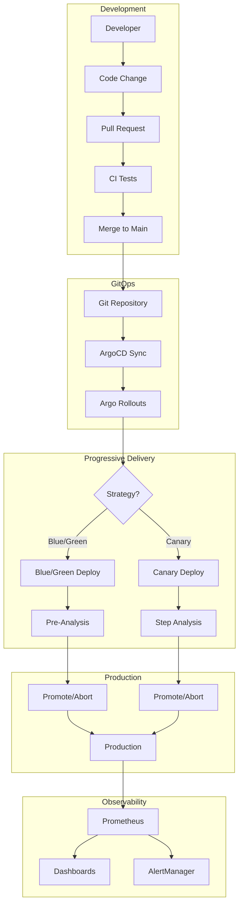
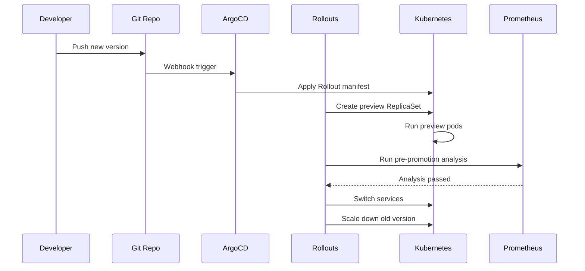

# Deployment and Rollout Workflow Documentation

## Overview

This guide provides comprehensive documentation for deploying and managing applications in the K8s Observable Rollouts environment. It covers the complete workflow from code changes to production deployment using GitOps principles with ArgoCD and progressive delivery with Argo Rollouts.

## Deployment Architecture Flow



## Prerequisites

Before starting deployments, ensure the following are in place:

1. **Infrastructure Ready**

   ```bash
   # Verify cluster is running
   kubectl cluster-info

   # Check all components are healthy
   kubectl get pods -A | grep -E "(argocd|prometheus|grafana|rollouts)"
   ```

2. **Access Configured**

   ```bash
   # ArgoCD CLI logged in
   argocd login argocd.local --username admin --password <password>

   # kubectl context set
   kubectl config current-context
   ```

3. **Git Repository Access**
   - SSH keys or tokens configured
   - Write access to the repository

## Development Workflow

### 1. Local Development Setup

```bash
# Clone repository
git clone https://github.com/your-org/k8s-observable-rollouts
cd k8s-observable-rollouts

# Create feature branch
git checkout -b feature/new-feature

# Set up local environment
python -m venv venv
source venv/bin/activate
pip install -r apps/sample-api/requirements.txt
pip install -r apps/sample-api/requirements-dev.txt

# Run local tests
cd apps/sample-api
pytest tests/
```

### 2. Making Changes

Follow these guidelines when making changes:

**Application Code Changes:**

```python
# apps/sample-api/app/routes/info.py
from app.version import version_info

@router.get("/feature")
async def new_feature():
    """New feature endpoint"""
    return {
        "feature": "enabled",
        "version": version_info.version,
        "timestamp": datetime.utcnow().isoformat()
    }
```

**Configuration Changes:**

```yaml
# charts/sample-api/values.yaml
config:
  features:
    newFeature: true
    featureConfig:
      timeout: 30
      retries: 3
```

**Version Updates:**

```yaml
# charts/sample-api/Chart.yaml
version: 0.2.0 # Chart version
appVersion: "1.1.0" # Application version
```

### 3. Testing Changes Locally

```bash
# Build and test Docker image
docker build -t sample-api:test .
docker run -p 8000:8000 sample-api:test

# Test with Minikube
minikube image build -t sample-api:test .
helm upgrade --install sample-api ./charts/sample-api \
  --set image.tag=test \
  --namespace sample-app
```

### 4. Committing Changes

```bash
# Stage changes
git add .

# Commit with conventional commit message
git commit -m "feat(api): add new feature endpoint

- Added /feature endpoint
- Updated version to 1.1.0
- Added feature flag configuration"

# Push branch
git push origin feature/new-feature
```

## CI/CD Pipeline

### 1. GitHub Actions Workflow

The CI pipeline automatically runs on pull requests:

```yaml
# .github/workflows/ci.yml
name: CI Pipeline

on:
  pull_request:
    branches: [main]
  push:
    branches: [main]

jobs:
  test:
    runs-on: ubuntu-latest
    steps:
      - uses: actions/checkout@v4

      - name: Run tests
        run: |
          cd apps/sample-api
          pip install -r requirements.txt
          pytest tests/

      - name: Build image
        run: |
          docker build -t sample-api:${{ github.sha }} apps/sample-api/

      - name: Security scan
        uses: aquasecurity/trivy-action@master
        with:
          image-ref: sample-api:${{ github.sha }}

      - name: Push to registry
        if: github.ref == 'refs/heads/main'
        run: |
          docker push sample-api:${{ github.sha }}
```

### 2. Automated Version Tagging

On merge to main, automatically create version tags:

```bash
# scripts/auto-tag.sh
#!/bin/bash
VERSION=$(cat charts/sample-api/Chart.yaml | grep appVersion | awk '{print $2}' | tr -d '"')
git tag -a "v${VERSION}" -m "Release version ${VERSION}"
git push origin "v${VERSION}"
```

## ArgoCD Deployment Process

### 1. Application Configuration

ArgoCD applications are configured to watch for changes:

```yaml
# infrastructure/argocd/applications/sample-app.yaml
apiVersion: argoproj.io/v1alpha1
kind: Application
metadata:
  name: sample-api
  namespace: argocd
spec:
  source:
    repoURL: https://github.com/your-org/k8s-observable-rollouts
    targetRevision: HEAD
    path: charts/sample-api
    helm:
      valueFiles:
        - values.yaml
        - values-prod.yaml
  destination:
    server: https://kubernetes.default.svc
    namespace: sample-app
  syncPolicy:
    automated:
      prune: true
      selfHeal: true
    syncOptions:
      - CreateNamespace=true
```

### 2. Manual Deployment Trigger

For manual deployments:

```bash
# Update image tag
argocd app set sample-api -p image.tag=v1.1.0

# Sync application
argocd app sync sample-api

# Watch sync status
argocd app get sample-api --refresh
```

### 3. GitOps Deployment Flow

**Step 1: Update Configuration**

```bash
# Update values file
sed -i 's/tag: .*/tag: v1.1.0/' charts/sample-api/values.yaml

# Commit and push
git add charts/sample-api/values.yaml
git commit -m "chore: update sample-api to v1.1.0"
git push origin main
```

**Step 2: ArgoCD Auto-Sync**

```bash
# Monitor sync status
watch argocd app get sample-api

# Or use kubectl
kubectl get application sample-api -n argocd -w
```

**Step 3: Verify Deployment**

```bash
# Check rollout status
kubectl argo rollouts get rollout sample-api -n sample-app

# Check pod status
kubectl get pods -n sample-app -l app=sample-api
```

## Progressive Delivery Workflows

### 1. Blue/Green Deployment

**Configuration:**

```yaml
# charts/sample-api/values.yaml
rollout:
  strategy: blueGreen
  blueGreen:
    autoPromotionEnabled: false
    scaleDownDelaySeconds: 30
    prePromotionAnalysis:
      enabled: true
```

**Deployment Process:**

```bash
# 1. Trigger deployment
kubectl set image rollout/sample-api sample-api=sample-api:v1.1.0 -n sample-app

# 2. Monitor preview environment
kubectl argo rollouts get rollout sample-api -n sample-app --watch

# 3. Test preview service
curl -H "Host: preview.app.local" http://app.local/api/version

# 4. Check analysis results
kubectl get analysisrun -n sample-app

# 5. Promote to production
kubectl argo rollouts promote sample-api -n sample-app

# 6. Verify production
curl http://app.local/api/version
```

**Automated Blue/Green Flow:**



### 2. Canary Deployment

**Configuration:**

```yaml
# charts/sample-api/values.yaml
rollout:
  strategy: canary
  canary:
    steps:
      - setWeight: 20
      - pause: { duration: 2m }
      - analysis:
          templates:
            - success-rate
      - setWeight: 50
      - pause: { duration: 2m }
      - setWeight: 100
```

**Deployment Process:**

```bash
# 1. Trigger canary deployment
kubectl set image rollout/sample-api sample-api=sample-api:v1.1.0 -n sample-app

# 2. Monitor canary progress
kubectl argo rollouts get rollout sample-api -n sample-app --watch

# 3. Check traffic distribution
# Make multiple requests and observe version distribution
for i in {1..100}; do
  curl -s http://app.local/api/version | jq -r .version
done | sort | uniq -c

# 4. View analysis runs
kubectl get analysisrun -n sample-app
kubectl describe analysisrun <analysis-run-name> -n sample-app

# 5. Manual promotion (if needed)
kubectl argo rollouts promote sample-api -n sample-app

# Or skip to full deployment
kubectl argo rollouts promote sample-api -n sample-app --full
```

**Canary Analysis Metrics:**

```promql
# Success rate for canary
sum(rate(http_requests_total{app="sample-api",version="canary",status!~"5.."}[2m])) /
sum(rate(http_requests_total{app="sample-api",version="canary"}[2m])) * 100

# Latency comparison
histogram_quantile(0.99,
  sum(rate(http_request_duration_seconds_bucket{app="sample-api",version="canary"}[2m])) by (le)
)
```

### 3. Advanced Deployment Patterns

**Feature Flag Deployment:**

```yaml
# Progressive feature enablement
apiVersion: v1
kind: ConfigMap
metadata:
  name: feature-flags
data:
  features.yaml: |
    features:
      new-algorithm:
        enabled: true
        rollout-percentage: 10
        whitelist:
          - user@example.com
```

**A/B Testing with Experiments:**

```yaml
apiVersion: argoproj.io/v1alpha1
kind: Experiment
metadata:
  name: algorithm-comparison
spec:
  duration: 2h
  templates:
    - name: baseline
      replicas: 1
      spec:
        containers:
          - name: sample-api
            image: sample-api:v1.0.0
            env:
              - name: ALGORITHM
                value: "baseline"
    - name: optimized
      replicas: 1
      spec:
        containers:
          - name: sample-api
            image: sample-api:v1.1.0
            env:
              - name: ALGORITHM
                value: "optimized"
  analyses:
    - name: performance-comparison
      templateName: response-time-comparison
```

## Monitoring During Rollouts

### 1. Real-time Dashboards

Access Grafana dashboards during rollouts:

```bash
# Port forward Grafana
kubectl port-forward svc/kube-prometheus-stack-grafana -n monitoring 3000:80

# Access dashboards
# - Rollout Progress: http://localhost:3000/d/rollouts
# - Application Metrics: http://localhost:3000/d/sample-api
# - Traffic Distribution: http://localhost:3000/d/traffic
```

### 2. CLI Monitoring

```bash
# Watch rollout status
kubectl argo rollouts get rollout sample-api -n sample-app --watch

# Follow logs
kubectl logs -f -n sample-app -l app=sample-api --all-containers

# Monitor metrics
kubectl exec -n monitoring prometheus-0 -- \
  promtool query instant \
  'sum(rate(http_requests_total{app="sample-api"}[1m])) by (version)'
```

### 3. Analysis Template Results

```bash
# List analysis runs
kubectl get analysisrun -n sample-app

# Get detailed analysis results
kubectl describe analysisrun <name> -n sample-app

# View analysis metrics
kubectl get analysisrun <name> -n sample-app -o jsonpath='{.status.metricResults[*]}'
```

## Rollback Procedures

### 1. Immediate Rollback

**During Active Rollout:**

```bash
# Abort current rollout
kubectl argo rollouts abort sample-api -n sample-app

# Rollout will immediately stop and revert
```

**After Completed Rollout:**

```bash
# Undo to previous version
kubectl argo rollouts undo sample-api -n sample-app

# Or rollback to specific revision
kubectl argo rollouts undo sample-api -n sample-app --to-revision=3
```

### 2. GitOps Rollback

**Revert Git Commit:**

```bash
# Find the commit to revert
git log --oneline charts/sample-api/

# Revert the commit
git revert <commit-hash>
git push origin main

# ArgoCD will sync to previous state
```

**Manual Git Rollback:**

```bash
# Update to previous version
sed -i 's/tag: v1.1.0/tag: v1.0.0/' charts/sample-api/values.yaml
git add charts/sample-api/values.yaml
git commit -m "rollback: revert sample-api to v1.0.0"
git push origin main
```

### 3. Emergency Procedures

**Bypass Progressive Delivery:**

```bash
# Scale down rollout controller temporarily
kubectl scale deployment argo-rollouts -n argo-rollouts --replicas=0

# Manually update deployment
kubectl set image deployment/sample-api sample-api=sample-api:v1.0.0 -n sample-app

# Restore rollout controller
kubectl scale deployment argo-rollouts -n argo-rollouts --replicas=1
```

**Force Sync in ArgoCD:**

```bash
# Force sync with replace strategy
argocd app sync sample-api --force --replace

# Or delete and recreate
argocd app delete sample-api
kubectl apply -f infrastructure/argocd/applications/sample-app.yaml
```

## Troubleshooting Guide

### 1. Common Deployment Issues

**Issue: Rollout Stuck in Progressing**

```bash
# Check rollout status
kubectl describe rollout sample-api -n sample-app

# Check for failing analysis
kubectl get analysisrun -n sample-app
kubectl logs -n sample-app -l job-name=<analysis-job>

# Force progression
kubectl argo rollouts promote sample-api -n sample-app --full
```

**Issue: Image Pull Errors**

```bash
# Check image exists
docker pull sample-api:v1.1.0

# Check pull secrets
kubectl get secrets -n sample-app
kubectl describe pod <pod-name> -n sample-app

# Create/update pull secret
kubectl create secret docker-registry regcred \
  --docker-server=<registry> \
  --docker-username=<username> \
  --docker-password=<password> \
  -n sample-app
```

**Issue: Service Not Accessible**

```bash
# Check service endpoints
kubectl get endpoints -n sample-app

# Check ingress configuration
kubectl describe ingress sample-api -n sample-app

# Test service directly
kubectl port-forward svc/sample-api 8080:80 -n sample-app
curl http://localhost:8080/health/ready
```

### 2. Analysis Failures

**Debugging Failed Analysis:**

```bash
# Get analysis details
kubectl describe analysisrun <name> -n sample-app

# Check Prometheus queries
curl -G http://prometheus.local/api/v1/query \
  --data-urlencode 'query=sum(rate(http_requests_total{app="sample-api"}[2m]))'

# Verify metrics exist
kubectl exec -n sample-app <pod> -- curl -s http://localhost:8000/metrics | grep http_requests_total
```

**Common Analysis Issues:**

- Metrics not available immediately (add initialDelay)
- Incorrect Prometheus queries
- Thresholds too strict
- Network policies blocking Prometheus

### 3. Rollback Issues

**Issue: Rollback Not Working**

```bash
# Check rollout history
kubectl argo rollouts history sample-api -n sample-app

# Verify previous versions exist
kubectl get rs -n sample-app -l app=sample-api

# Manual rollback via ReplicaSet
kubectl get rs -n sample-app
kubectl scale rs <old-rs-name> --replicas=2
kubectl scale rs <new-rs-name> --replicas=0
```

## Best Practices

### 1. Deployment Checklist

Before deploying:

- [ ] All tests passing in CI
- [ ] Security scans completed
- [ ] Version tags updated
- [ ] Changelog updated
- [ ] Rollback plan documented
- [ ] Monitoring dashboards ready
- [ ] Alerts configured
- [ ] Team notified

### 2. Progressive Delivery Guidelines

1. **Start Conservative**

   - Begin with longer pause durations
   - Use strict analysis thresholds
   - Small traffic percentages for canary

2. **Monitor Actively**

   - Watch dashboards during rollout
   - Set up alerts for anomalies
   - Have rollback commands ready

3. **Automate Gradually**
   - Start with manual promotion
   - Add automation after confidence
   - Keep manual override options

### 3. Configuration Management

```yaml
# Separate environment configs
charts/sample-api/
├── values.yaml          # Base values
├── values-dev.yaml      # Development overrides
├── values-staging.yaml  # Staging overrides
└── values-prod.yaml     # Production overrides

# Environment-specific strategies
# Dev: Fast blue/green with auto-promotion
# Staging: Full canary with manual gates
# Prod: Conservative canary with strict analysis
```

### 4. Communication Protocol

**Deployment Notifications:**

```bash
# Slack webhook example
curl -X POST -H 'Content-type: application/json' \
  --data '{"text":"Deploying sample-api v1.1.0 to production"}' \
  $SLACK_WEBHOOK_URL

# Or use ArgoCD notifications
kubectl patch application sample-api -n argocd --type merge -p '
metadata:
  annotations:
    notifications.argoproj.io/subscribe.on-deployed.slack: deployments
'
```

## Automation Scripts

### 1. Deployment Script

Create `scripts/deploy.sh`:

```bash
#!/bin/bash
set -euo pipefail

VERSION=${1:-}
ENVIRONMENT=${2:-staging}
APP_NAME="sample-api"

if [ -z "$VERSION" ]; then
    echo "Usage: $0 <version> [environment]"
    exit 1
fi

echo "🚀 Deploying ${APP_NAME} ${VERSION} to ${ENVIRONMENT}"

# Update values file
case $ENVIRONMENT in
    dev)
        VALUES_FILE="values-dev.yaml"
        NAMESPACE="sample-app-dev"
        ;;
    staging)
        VALUES_FILE="values-staging.yaml"
        NAMESPACE="sample-app-staging"
        ;;
    prod)
        VALUES_FILE="values-prod.yaml"
        NAMESPACE="sample-app"
        ;;
    *)
        echo "Unknown environment: $ENVIRONMENT"
        exit 1
        ;;
esac

# Update image tag
yq eval ".image.tag = \"${VERSION}\"" -i charts/${APP_NAME}/${VALUES_FILE}

# Commit and push
git add charts/${APP_NAME}/${VALUES_FILE}
git commit -m "deploy: ${APP_NAME} ${VERSION} to ${ENVIRONMENT}"
git push origin main

# Wait for ArgoCD sync
echo "⏳ Waiting for ArgoCD sync..."
argocd app wait ${APP_NAME}-${ENVIRONMENT} --sync

# Monitor rollout
echo "📊 Monitoring rollout..."
kubectl argo rollouts get rollout ${APP_NAME} -n ${NAMESPACE} --watch
```

### 2. Rollback Script

Create `scripts/rollback.sh`:

```bash
#!/bin/bash
set -euo pipefail

APP_NAME=${1:-sample-api}
NAMESPACE=${2:-sample-app}
TO_REVISION=${3:-}

echo "⚠️  Rolling back ${APP_NAME} in ${NAMESPACE}"

if [ -n "$TO_REVISION" ]; then
    echo "Rolling back to revision ${TO_REVISION}"
    kubectl argo rollouts undo ${APP_NAME} -n ${NAMESPACE} --to-revision=${TO_REVISION}
else
    echo "Rolling back to previous version"
    kubectl argo rollouts undo ${APP_NAME} -n ${NAMESPACE}
fi

# Monitor rollback
kubectl argo rollouts get rollout ${APP_NAME} -n ${NAMESPACE} --watch
```

### 3. Health Check Script

Create `scripts/health-check.sh`:

```bash
#!/bin/bash
set -euo pipefail

ENDPOINT=${1:-http://app.local}
EXPECTED_VERSION=${2:-}

echo "🏥 Performing health checks on ${ENDPOINT}"

# Basic health check
HTTP_CODE=$(curl -s -o /dev/null -w "%{http_code}" ${ENDPOINT}/health/ready)
if [ $HTTP_CODE -eq 200 ]; then
    echo "✅ Health check passed"
else
    echo "❌ Health check failed (HTTP ${HTTP_CODE})"
    exit 1
fi

# Version check
if [ -n "$EXPECTED_VERSION" ]; then
    ACTUAL_VERSION=$(curl -s ${ENDPOINT}/api/version | jq -r .version)
    if [ "$ACTUAL_VERSION" == "$EXPECTED_VERSION" ]; then
        echo "✅ Version check passed (${ACTUAL_VERSION})"
    else
        echo "❌ Version mismatch (expected: ${EXPECTED_VERSION}, actual: ${ACTUAL_VERSION})"
        exit 1
    fi
fi

# Metrics check
METRICS=$(curl -s ${ENDPOINT}/metrics | grep -c "^http_requests_total")
if [ $METRICS -gt 0 ]; then
    echo "✅ Metrics endpoint working"
else
    echo "❌ Metrics not available"
    exit 1
fi

echo "✅ All health checks passed!"
```

## Summary

This deployment and rollout workflow provides:

1. **Complete Development Lifecycle**: From local development to production
2. **GitOps Integration**: Automated deployments via ArgoCD
3. **Progressive Delivery**: Safe rollouts with Blue/Green and Canary
4. **Comprehensive Monitoring**: Real-time visibility during deployments
5. **Robust Rollback**: Multiple rollback strategies for different scenarios
6. **Troubleshooting Guide**: Solutions for common issues
7. **Automation Scripts**: Streamlined deployment operations

The workflow ensures safe, observable, and reversible deployments with minimal manual intervention while maintaining full control when needed.
