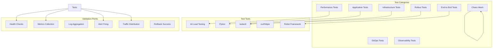

# Integration Testing Scenarios

## Overview

This document outlines comprehensive integration testing scenarios for the K8s Observable Rollouts project. The tests cover infrastructure setup, GitOps workflows, progressive delivery strategies, observability, and failure scenarios.

## Testing Architecture



## Test Environment Setup

### 1. Test Framework Installation

Create `scripts/setup-test-env.sh`:

```bash
#!/bin/bash
set -euo pipefail

echo "🧪 Setting up test environment..."

# Install Python test dependencies
pip install -r tests/requirements.txt

# Install k6 for load testing
if ! command -v k6 &> /dev/null; then
    echo "Installing k6..."
    sudo apt-key adv --keyserver hkp://keyserver.ubuntu.com:80 --recv-keys C5AD17C747E3415A3642D57D77C6C491D6AC1D69
    echo "deb https://dl.k6.io/deb stable main" | sudo tee /etc/apt/sources.list.d/k6.list
    sudo apt-get update
    sudo apt-get install k6
fi

# Install httpie for API testing
pip install httpie

# Install Robot Framework for E2E tests
pip install robotframework robotframework-requests robotframework-kubelibrary

# Install Chaos Mesh
echo "Installing Chaos Mesh..."
curl -sSL https://mirrors.chaos-mesh.org/v2.5.1/install.sh | bash -s -- --local kind

echo "✅ Test environment setup complete!"
```

### 2. Test Configuration

Create `tests/config.yaml`:

```yaml
test_config:
  cluster:
    name: k8s-rollouts
    context: k8s-rollouts

  namespaces:
    app: sample-app
    monitoring: monitoring
    argocd: argocd
    rollouts: argo-rollouts

  endpoints:
    app: http://app.local
    grafana: http://grafana.local
    prometheus: http://prometheus.local
    argocd: https://argocd.local
    rollouts: http://rollouts.local

  timeouts:
    default: 30s
    deployment: 5m
    rollout: 10m
    analysis: 5m

  thresholds:
    success_rate: 99
    latency_p95: 200
    latency_p99: 500
    error_rate: 1
```

## Infrastructure Tests

### 1. Cluster Validation Tests

Create `tests/infrastructure/test_cluster.py`:

```python
import pytest
import subprocess
import yaml
from kubernetes import client, config

class TestClusterInfrastructure:

    @pytest.fixture(scope="class")
    def k8s_client(self):
        config.load_kube_config(context="k8s-rollouts")
        return client.CoreV1Api()

    def test_cluster_nodes_ready(self, k8s_client):
        """Test all cluster nodes are in Ready state"""
        nodes = k8s_client.list_node()
        assert len(nodes.items) > 0, "No nodes found in cluster"

        for node in nodes.items:
            conditions = node.status.conditions
            ready_condition = next(
                (c for c in conditions if c.type == "Ready"),
                None
            )
            assert ready_condition is not None, f"Node {node.metadata.name} missing Ready condition"
            assert ready_condition.status == "True", f"Node {node.metadata.name} is not Ready"

    def test_required_namespaces_exist(self, k8s_client):
        """Test all required namespaces exist"""
        required_namespaces = [
            "default", "kube-system", "ingress-nginx",
            "argocd", "monitoring", "sample-app", "argo-rollouts"
        ]

        namespaces = k8s_client.list_namespace()
        existing_namespaces = [ns.metadata.name for ns in namespaces.items]

        for ns in required_namespaces:
            assert ns in existing_namespaces, f"Required namespace '{ns}' not found"

    def test_storage_classes_available(self):
        """Test storage classes are properly configured"""
        v1 = client.StorageV1Api()
        storage_classes = v1.list_storage_class()

        assert len(storage_classes.items) > 0, "No storage classes found"

        # Check for default storage class
        default_sc = next(
            (sc for sc in storage_classes.items
             if sc.metadata.annotations.get("storageclass.kubernetes.io/is-default-class") == "true"),
            None
        )
        assert default_sc is not None, "No default storage class found"

    def test_ingress_controller_running(self, k8s_client):
        """Test NGINX ingress controller is running"""
        pods = k8s_client.list_namespaced_pod(
            namespace="ingress-nginx",
            label_selector="app.kubernetes.io/component=controller"
        )

        assert len(pods.items) > 0, "No ingress controller pods found"

        for pod in pods.items:
            assert pod.status.phase == "Running", f"Ingress pod {pod.metadata.name} not running"

            # Check all containers are ready
            for container_status in pod.status.container_statuses:
                assert container_status.ready, f"Container {container_status.name} not ready"

    def test_dns_resolution(self):
        """Test cluster DNS is working"""
        result = subprocess.run(
            ["kubectl", "run", "dns-test", "--image=busybox:1.28", "--rm", "-i", "--restart=Never", "--",
             "nslookup", "kubernetes.default"],
            capture_output=True,
            text=True
        )
        assert result.returncode == 0, f"DNS resolution failed: {result.stderr}"
        assert "kubernetes.default.svc.cluster.local" in result.stdout
```

### 2. Component Health Tests

Create `tests/infrastructure/test_components.py`:

```python
import requests
import pytest
from kubernetes import client, config

class TestComponentHealth:

    @pytest.fixture(scope="class")
    def k8s_apps(self):
        config.load_kube_config(context="k8s-rollouts")
        return client.AppsV1Api()

    def test_argocd_health(self, k8s_apps):
        """Test ArgoCD components are healthy"""
        deployments = [
            "argocd-server",
            "argocd-repo-server",
            "argocd-applicationset-controller",
            "argocd-notifications-controller"
        ]

        for deployment_name in deployments:
            deployment = k8s_apps.read_namespaced_deployment(
                name=deployment_name,
                namespace="argocd"
            )
            assert deployment.status.ready_replicas == deployment.status.replicas, \
                f"{deployment_name} not fully ready"

    def test_prometheus_health(self):
        """Test Prometheus is healthy and scraping targets"""
        # Check Prometheus API
        response = requests.get("http://prometheus.local/api/v1/query?query=up")
        assert response.status_code == 200, "Prometheus API not responding"

        # Check targets are being scraped
        targets_response = requests.get("http://prometheus.local/api/v1/targets")
        assert targets_response.status_code == 200

        targets = targets_response.json()
        active_targets = [t for t in targets["data"]["activeTargets"] if t["health"] == "up"]
        assert len(active_targets) > 0, "No healthy Prometheus targets found"

    def test_grafana_health(self):
        """Test Grafana is accessible and has datasources"""
        # Check Grafana API
        response = requests.get("http://grafana.local/api/health")
        assert response.status_code == 200
        assert response.json()["database"] == "ok"

        # Check datasources (requires auth)
        auth = ("admin", "admin")  # Use actual credentials
        ds_response = requests.get("http://grafana.local/api/datasources", auth=auth)
        assert ds_response.status_code == 200

        datasources = ds_response.json()
        assert len(datasources) > 0, "No datasources configured in Grafana"

        # Check Prometheus datasource exists
        prometheus_ds = next((ds for ds in datasources if ds["type"] == "prometheus"), None)
        assert prometheus_ds is not None, "Prometheus datasource not found"

    def test_rollouts_controller_health(self, k8s_apps):
        """Test Argo Rollouts controller is healthy"""
        deployment = k8s_apps.read_namespaced_deployment(
            name="argo-rollouts",
            namespace="argo-rollouts"
        )
        assert deployment.status.ready_replicas == deployment.status.replicas

        # Check CRDs are installed
        api_client = client.ApiClient()
        custom_api = client.CustomObjectsApi(api_client)

        try:
            custom_api.list_cluster_custom_object(
                group="argoproj.io",
                version="v1alpha1",
                plural="rollouts"
            )
        except Exception as e:
            pytest.fail(f"Rollout CRD not available: {e}")
```

## Application Tests

### 1. API Functionality Tests

Create `tests/application/test_api.py`:

```python
import pytest
import requests
import time
from concurrent.futures import ThreadPoolExecutor

class TestSampleAPI:

    BASE_URL = "http://app.local"

    def test_root_endpoint(self):
        """Test root endpoint returns HTML"""
        response = requests.get(f"{self.BASE_URL}/")
        assert response.status_code == 200
        assert "text/html" in response.headers["content-type"]
        assert "Sample API" in response.text

    def test_health_endpoints(self):
        """Test all health check endpoints"""
        endpoints = ["/health/live", "/health/ready", "/health/startup"]

        for endpoint in endpoints:
            response = requests.get(f"{self.BASE_URL}{endpoint}")
            assert response.status_code == 200
            data = response.json()
            assert "status" in data
            assert "timestamp" in data
            assert "version" in data

    def test_version_endpoint(self):
        """Test version information endpoint"""
        response = requests.get(f"{self.BASE_URL}/api/version")
        assert response.status_code == 200

        data = response.json()
        required_fields = ["version", "build_number", "git_commit", "environment"]
        for field in required_fields:
            assert field in data, f"Missing field: {field}"

    def test_metrics_endpoint(self):
        """Test Prometheus metrics endpoint"""
        response = requests.get(f"{self.BASE_URL}/metrics")
        assert response.status_code == 200
        assert "text/plain" in response.headers["content-type"]

        # Check for expected metrics
        metrics_text = response.text
        expected_metrics = [
            "http_requests_total",
            "http_request_duration_seconds",
            "http_requests_active",
            "app_version_info"
        ]

        for metric in expected_metrics:
            assert metric in metrics_text, f"Metric {metric} not found"

    def test_slow_endpoint(self):
        """Test slow endpoint with custom delay"""
        delay = 2
        start_time = time.time()
        response = requests.get(f"{self.BASE_URL}/demo/slow?delay={delay}")
        end_time = time.time()

        assert response.status_code == 200
        assert (end_time - start_time) >= delay

        data = response.json()
        assert data["delay"] == delay

    def test_error_endpoint(self):
        """Test error simulation endpoint"""
        # Test with 0% error rate (should succeed)
        response = requests.get(f"{self.BASE_URL}/demo/error?rate=0")
        assert response.status_code == 200

        # Test with 100% error rate (should fail)
        response = requests.get(f"{self.BASE_URL}/demo/error?rate=100")
        assert response.status_code == 500

    def test_concurrent_requests(self):
        """Test API handles concurrent requests properly"""
        def make_request(i):
            response = requests.get(f"{self.BASE_URL}/api/info")
            return response.status_code

        with ThreadPoolExecutor(max_workers=10) as executor:
            futures = [executor.submit(make_request, i) for i in range(50)]
            results = [f.result() for f in futures]

        # All requests should succeed
        assert all(status == 200 for status in results)
```

### 2. Application Behavior Tests

Create `tests/application/test_behavior.py`:

```python
import pytest
import requests
import json

class TestApplicationBehavior:

    def test_request_id_tracking(self):
        """Test request ID is properly tracked"""
        headers = {"X-Request-ID": "test-123"}
        response = requests.get("http://app.local/api/info", headers=headers)

        # Check if request ID is returned in response headers
        assert "X-Request-ID" in response.headers
        assert response.headers["X-Request-ID"] == "test-123"

    def test_cors_headers(self):
        """Test CORS headers are properly set"""
        response = requests.options(
            "http://app.local/api/version",
            headers={"Origin": "http://example.com"}
        )

        assert response.status_code == 200
        assert "Access-Control-Allow-Origin" in response.headers
        assert response.headers["Access-Control-Allow-Origin"] == "*"

    def test_content_types(self):
        """Test different content types are handled correctly"""
        # JSON endpoint
        json_response = requests.get("http://app.local/api/version")
        assert "application/json" in json_response.headers["content-type"]

        # HTML endpoint
        html_response = requests.get("http://app.local/html")
        assert "text/html" in html_response.headers["content-type"]

        # Metrics endpoint
        metrics_response = requests.get("http://app.local/metrics")
        assert "text/plain" in metrics_response.headers["content-type"]

    def test_error_handling(self):
        """Test application error handling"""
        # Test 404 handling
        response = requests.get("http://app.local/nonexistent")
        assert response.status_code == 404

        # Test invalid query parameters
        response = requests.get("http://app.local/demo/slow?delay=invalid")
        assert response.status_code == 422  # Validation error

    def test_graceful_shutdown(self):
        """Test application handles shutdown gracefully"""
        # This would require coordination with the deployment
        # For now, we'll test that the app responds to signals
        pass
```

## GitOps Workflow Tests

### 1. ArgoCD Sync Tests

Create `tests/gitops/test_argocd_sync.py`:

```python
import pytest
import subprocess
import yaml
import time

class TestArgoCDSync:

    def run_kubectl(self, cmd):
        """Helper to run kubectl commands"""
        result = subprocess.run(
            f"kubectl {cmd}",
            shell=True,
            capture_output=True,
            text=True
        )
        return result

    def test_application_sync_status(self):
        """Test all ArgoCD applications are synced"""
        result = self.run_kubectl(
            "get applications -n argocd -o json"
        )
        assert result.returncode == 0

        apps = yaml.safe_load(result.stdout)
        for app in apps.get("items", []):
            sync_status = app["status"]["sync"]["status"]
            health_status = app["status"]["health"]["status"]

            assert sync_status == "Synced", \
                f"App {app['metadata']['name']} not synced: {sync_status}"
            assert health_status == "Healthy", \
                f"App {app['metadata']['name']} not healthy: {health_status}"

    def test_manual_sync_trigger(self):
        """Test manual sync can be triggered"""
        app_name = "sample-api"

        # Trigger sync
        result = self.run_kubectl(
            f"patch application {app_name} -n argocd --type merge -p '{{\"metadata\":{{\"annotations\":{{\"test-sync\":\"true\"}}}}}}'"
        )
        assert result.returncode == 0

        # Wait for sync to complete
        time.sleep(10)

        # Check sync completed
        result = self.run_kubectl(
            f"get application {app_name} -n argocd -o jsonpath='{{.status.sync.status}}'"
        )
        assert result.stdout.strip() == "Synced"

    def test_auto_sync_behavior(self):
        """Test auto-sync works when enabled"""
        # This test would modify a git repo and verify sync happens
        # For now, we'll check auto-sync is configured
        result = self.run_kubectl(
            "get applications -n argocd -o json"
        )

        apps = yaml.safe_load(result.stdout)
        for app in apps.get("items", []):
            if app["metadata"]["name"] == "sample-api":
                auto_sync = app["spec"]["syncPolicy"]["automated"]
                assert auto_sync["prune"] == True
                assert auto_sync["selfHeal"] == True

    def test_sync_waves(self):
        """Test resources are created in correct order using sync waves"""
        # Deploy a test application with sync waves
        test_app = """
apiVersion: argoproj.io/v1alpha1
kind: Application
metadata:
  name: sync-wave-test
  namespace: argocd
spec:
  source:
    repoURL: https://github.com/your-org/k8s-observable-rollouts
    path: tests/fixtures/sync-waves
    targetRevision: HEAD
  destination:
    server: https://kubernetes.default.svc
    namespace: default
  syncPolicy:
    automated:
      prune: true
"""
        # Apply and verify resources are created in order
        # This would require test fixtures with sync wave annotations
        pass
```

### 2. Configuration Drift Tests

Create `tests/gitops/test_drift_detection.py`:

```python
import pytest
import subprocess
import time

class TestDriftDetection:

    def test_drift_detection(self):
        """Test ArgoCD detects configuration drift"""
        # Manually modify a resource
        result = subprocess.run(
            "kubectl patch deployment sample-api -n sample-app "
            "--type merge -p '{\"spec\":{\"replicas\":5}}'",
            shell=True,
            capture_output=True
        )
        assert result.returncode == 0

        # Wait for ArgoCD to detect drift
        time.sleep(30)

        # Check application is out of sync
        result = subprocess.run(
            "kubectl get application sample-api -n argocd "
            "-o jsonpath='{.status.sync.status}'",
            shell=True,
            capture_output=True,
            text=True
        )
        assert result.stdout.strip() == "OutOfSync"

    def test_self_healing(self):
        """Test ArgoCD self-heals drifted resources"""
        # Create drift
        subprocess.run(
            "kubectl patch deployment sample-api -n sample-app "
            "--type merge -p '{\"spec\":{\"replicas\":10}}'",
            shell=True
        )

        # Wait for self-healing (if enabled)
        time.sleep(60)

        # Check resource is healed
        result = subprocess.run(
            "kubectl get deployment sample-api -n sample-app "
            "-o jsonpath='{.spec.replicas}'",
            shell=True,
            capture_output=True,
            text=True
        )

        # Should be back to original value (2)
        assert int(result.stdout.strip()) == 2
```

## Progressive Delivery Tests

### 1. Blue/Green Deployment Tests

Create `tests/rollouts/test_bluegreen.py`:

```python
import pytest
import subprocess
import time
import requests

class TestBlueGreenDeployment:

    def get_rollout_status(self, name, namespace):
        """Get rollout status"""
        result = subprocess.run(
            f"kubectl get rollout {name} -n {namespace} -o json",
            shell=True,
            capture_output=True,
            text=True
        )
        return json.loads(result.stdout)

    def test_bluegreen_deployment(self):
        """Test blue/green deployment workflow"""
        namespace = "sample-app"
        rollout_name = "sample-api"

        # Update image to trigger rollout
        subprocess.run(
            f"kubectl set image rollout/{rollout_name} "
            f"sample-api=sample-api:v2.0.0 -n {namespace}",
            shell=True
        )

        # Wait for preview service to be ready
        time.sleep(30)

        # Check preview service is serving new version
        preview_response = requests.get("http://app.local",
                                      headers={"Host": "preview.app.local"})
        assert "v2.0.0" in preview_response.text

        # Check active service still serves old version
        active_response = requests.get("http://app.local")
        assert "v1.0.0" in active_response.text

        # Promote rollout
        subprocess.run(
            f"kubectl argo rollouts promote {rollout_name} -n {namespace}",
            shell=True
        )

        # Wait for promotion
        time.sleep(30)

        # Check active service now serves new version
        active_response = requests.get("http://app.local")
        assert "v2.0.0" in active_response.text

    def test_bluegreen_rollback(self):
        """Test blue/green rollback"""
        namespace = "sample-app"
        rollout_name = "sample-api"

        # Trigger bad deployment
        subprocess.run(
            f"kubectl set image rollout/{rollout_name} "
            f"sample-api=sample-api:bad-version -n {namespace}",
            shell=True
        )

        # Wait for rollout to detect failure
        time.sleep(60)

        # Abort rollout
        subprocess.run(
            f"kubectl argo rollouts abort {rollout_name} -n {namespace}",
            shell=True
        )

        # Verify rollback
        status = self.get_rollout_status(rollout_name, namespace)
        assert status["status"]["phase"] == "Healthy"
        assert status["status"]["abort"] == True

    def test_analysis_during_bluegreen(self):
        """Test analysis runs during blue/green deployment"""
        # This test would verify analysis templates are executed
        # and affect the rollout decision
        pass
```

### 2. Canary Deployment Tests

Create `tests/rollouts/test_canary.py`:

```python
import pytest
import subprocess
import time
import requests
from concurrent.futures import ThreadPoolExecutor

class TestCanaryDeployment:

    def test_canary_traffic_split(self):
        """Test traffic is properly split during canary"""
        namespace = "sample-app"
        rollout_name = "sample-api"

        # Configure for canary strategy
        subprocess.run(
            f"kubectl patch rollout {rollout_name} -n {namespace} "
            "--type merge -p '{\"spec\":{\"strategy\":{\"canary\":{}}}}'",
            shell=True
        )

        # Trigger canary deployment
        subprocess.run(
            f"kubectl set image rollout/{rollout_name} "
            f"sample-api=sample-api:v2.0.0 -n {namespace}",
            shell=True
        )

        # Wait for canary to start (20% traffic)
        time.sleep(60)

        # Make 100 requests and check version distribution
        def make_request():
            response = requests.get("http://app.local/api/version")
            return response.json()["version"]

        with ThreadPoolExecutor(max_workers=10) as executor:
            futures = [executor.submit(make_request) for _ in range(100)]
            versions = [f.result() for f in futures]

        # Count versions
        v1_count = versions.count("v1.0.0")
        v2_count = versions.count("v2.0.0")

        # Should be approximately 80/20 split
        assert 70 <= v1_count <= 90, f"V1 count {v1_count} not in expected range"
        assert 10 <= v2_count <= 30, f"V2 count {v2_count} not in expected range"

    def test_canary_promotion_steps(self):
        """Test canary proceeds through all steps"""
        namespace = "sample-app"
        rollout_name = "sample-api"

        # Monitor rollout steps
        steps_completed = []

        # Start deployment
        subprocess.run(
            f"kubectl set image rollout/{rollout_name} "
            f"sample-api=sample-api:v2.0.0 -n {namespace}",
            shell=True
        )

        # Monitor progress
        for i in range(20):  # Check for 10 minutes
            result = subprocess.run(
                f"kubectl get rollout {rollout_name} -n {namespace} "
                "-o jsonpath='{.status.currentStepIndex}'",
                shell=True,
                capture_output=True,
                text=True
            )

            current_step = int(result.stdout.strip() or "0")
            if current_step not in steps_completed:
                steps_completed.append(current_step)

            # Check if rollout completed
            status_result = subprocess.run(
                f"kubectl get rollout {rollout_name} -n {namespace} "
                "-o jsonpath='{.status.phase}'",
                shell=True,
                capture_output=True,
                text=True
            )

            if status_result.stdout.strip() == "Healthy":
                break

            time.sleep(30)

        # Verify all steps were executed
        assert len(steps_completed) >= 3, "Not all canary steps were executed"

    def test_canary_analysis_failure(self):
        """Test canary aborts on analysis failure"""
        # This test would inject failures to trigger analysis failure
        # and verify the canary is aborted
        pass
```

## Load and Performance Tests

### 1. Load Testing Configuration

Create `tests/performance/load-test.js`:

```javascript
import http from "k6/http";
import { check, sleep } from "k6";
import { Rate } from "k6/metrics";

// Custom metrics
const errorRate = new Rate("errors");
const successRate = new Rate("success");

// Test configuration
export const options = {
  stages: [
    { duration: "2m", target: 50 }, // Ramp up to 50 users
    { duration: "5m", target: 50 }, // Stay at 50 users
    { duration: "2m", target: 100 }, // Ramp up to 100 users
    { duration: "5m", target: 100 }, // Stay at 100 users
    { duration: "2m", target: 0 }, // Ramp down to 0 users
  ],
  thresholds: {
    http_req_duration: ["p(95)<500"], // 95% of requests must complete below 500ms
    http_req_failed: ["rate<0.1"], // Error rate must be below 10%
    errors: ["rate<0.05"], // Custom error rate below 5%
  },
};

const BASE_URL = "http://app.local";

export default function () {
  // Test different endpoints with weights
  const endpoints = [
    { url: "/", weight: 0.1 },
    { url: "/api/version", weight: 0.3 },
    { url: "/api/info", weight: 0.3 },
    { url: "/health/ready", weight: 0.2 },
    { url: "/demo/slow?delay=1", weight: 0.1 },
  ];

  // Select endpoint based on weight
  const random = Math.random();
  let accumulator = 0;
  let selectedEndpoint;

  for (const endpoint of endpoints) {
    accumulator += endpoint.weight;
    if (random <= accumulator) {
      selectedEndpoint = endpoint;
      break;
    }
  }

  // Make request
  const response = http.get(`${BASE_URL}${selectedEndpoint.url}`);

  // Check response
  const success = check(response, {
    "status is 200": (r) => r.status === 200,
    "response time < 500ms": (r) => r.timings.duration < 500,
    "response has body": (r) => r.body.length > 0,
  });

  // Record metrics
  errorRate.add(!success);
  successRate.add(success);

  // Think time
  sleep(1);
}

export function handleSummary(data) {
  return {
    stdout: textSummary(data, { indent: " ", enableColors: true }),
    "load-test-results.json": JSON.stringify(data),
  };
}
```

### 2. Performance Test Execution

Create `tests/performance/test_performance.py`:

```python
import pytest
import subprocess
import json
import time

class TestPerformance:

    def test_baseline_performance(self):
        """Test application meets baseline performance requirements"""
        # Run k6 load test
        result = subprocess.run(
            "k6 run tests/performance/load-test.js",
            shell=True,
            capture_output=True,
            text=True
        )

        assert result.returncode == 0, f"Load test failed: {result.stderr}"

        # Parse results
        with open("load-test-results.json", "r") as f:
            results = json.load(f)

        # Check thresholds
        metrics = results["metrics"]

        # P95 latency should be under 500ms
        p95_latency = metrics["http_req_duration"]["p(95)"]
        assert p95_latency < 500, f"P95 latency {p95_latency}ms exceeds threshold"

        # Error rate should be under 1%
        error_rate = metrics["http_req_failed"]["rate"]
        assert error_rate < 0.01, f"Error rate {error_rate} exceeds threshold"

    def test_autoscaling_behavior(self):
        """Test HPA scales pods under load"""
        namespace = "sample-app"
        deployment = "sample-api"

        # Get initial replica count
        initial_replicas = self._get_replica_count(namespace, deployment)

        # Generate load
        subprocess.Popen(
            "k6 run --vus 200 --duration 5m tests/performance/load-test.js",
            shell=True
        )

        # Wait for HPA to react
        time.sleep(120)

        # Check if scaled up
        current_replicas = self._get_replica_count(namespace, deployment)
        assert current_replicas > initial_replicas, \
            f"HPA did not scale up (initial: {initial_replicas}, current: {current_replicas})"

        # Wait for load to finish and scale down
        time.sleep(300)

        # Check if scaled back down
        final_replicas = self._get_replica_count(namespace, deployment)
        assert final_replicas <= initial_replicas + 1, \
            f"HPA did not scale down (final: {final_replicas})"

    def _get_replica_count(self, namespace, deployment):
        """Get current replica count for a deployment"""
        result = subprocess.run(
            f"kubectl get deployment {deployment} -n {namespace} "
            "-o jsonpath='{.status.readyReplicas}'",
            shell=True,
            capture_output=True,
            text=True
        )
        return int(result.stdout.strip() or "0")

    def test_resource_limits(self):
        """Test application respects resource limits"""
        # This would monitor resource usage during load test
        # and verify it stays within configured limits
        pass
```

## Observability Tests

### 1. Metrics Collection Tests

Create `tests/observability/test_metrics.py`:

```python
import pytest
import requests
import time

class TestMetricsCollection:

    PROMETHEUS_URL = "http://prometheus.local"

    def query_prometheus(self, query):
        """Execute Prometheus query"""
        response = requests.get(
            f"{self.PROMETHEUS_URL}/api/v1/query",
            params={"query": query}
        )
        assert response.status_code == 200
        return response.json()

    def test_application_metrics_collected(self):
        """Test application metrics are being collected"""
        metrics = [
            "http_requests_total",
            "http_request_duration_seconds_bucket",
            "http_requests_active",
            "app_version_info"
        ]

        for metric in metrics:
            result = self.query_prometheus(f'{metric}{{app_kubernetes_io_name="sample-api"}}')
            assert result["status"] == "success"
            assert len(result["data"]["result"]) > 0, f"No data for metric {metric}"

    def test_infrastructure_metrics_collected(self):
        """Test infrastructure metrics are being collected"""
        queries = [
            'up{job="kubernetes-nodes"}',
            'node_cpu_seconds_total',
            'node_memory_MemAvailable_bytes',
            'container_cpu_usage_seconds_total'
        ]

        for query in queries:
            result = self.query_prometheus(query)
            assert result["status"] == "success"
            assert len(result["data"]["result"]) > 0, f"No data for query {query}"

    def test_rollout_metrics_collected(self):
        """Test Argo Rollouts metrics are collected"""
        rollout_metrics = [
            "rollout_info",
            "rollout_phase",
            "analysis_run_info",
            "analysis_run_metric_phase"
        ]

        for metric in rollout_metrics:
            result = self.query_prometheus(metric)
            # These might be empty if no rollouts are active
            assert result["status"] == "success"

    def test_servicemonitors_working(self):
        """Test ServiceMonitors are properly configured"""
        # Check targets page
        response = requests.get(f"{self.PROMETHEUS_URL}/api/v1/targets")
        assert response.status_code == 200

        targets = response.json()["data"]["activeTargets"]

        # Check expected targets are present
        expected_jobs = [
            "sample-api",
            "argocd-metrics",
            "argo-rollouts-metrics",
            "kubernetes-nodes",
            "kubernetes-pods"
        ]

        active_jobs = {target["labels"]["job"] for target in targets}

        for job in expected_jobs:
            assert job in active_jobs, f"Job {job} not found in active targets"
```

### 2. Dashboard Tests

Create `tests/observability/test_dashboards.py`:

```python
import pytest
import requests

class TestGrafanaDashboards:

    GRAFANA_URL = "http://grafana.local"
    AUTH = ("admin", "admin")  # Use actual credentials

    def test_dashboards_loaded(self):
        """Test all expected dashboards are loaded"""
        response = requests.get(
            f"{self.GRAFANA_URL}/api/search",
            auth=self.AUTH
        )
        assert response.status_code == 200

        dashboards = response.json()
        dashboard_titles = {d["title"] for d in dashboards}

        expected_dashboards = [
            "Sample API Dashboard",
            "Argo Rollouts Dashboard",
            "Kubernetes Cluster Monitoring",
            "NGINX Ingress Controller"
        ]

        for expected in expected_dashboards:
            assert expected in dashboard_titles, f"Dashboard '{expected}' not found"

    def test_datasources_configured(self):
        """Test datasources are properly configured"""
        response = requests.get(
            f"{self.GRAFANA_URL}/api/datasources",
            auth=self.AUTH
        )
        assert response.status_code == 200

        datasources = response.json()
        ds_types = {ds["type"] for ds in datasources}

        assert "prometheus" in ds_types, "Prometheus datasource not found"

        # Test datasource connectivity
        for ds in datasources:
            if ds["type"] == "prometheus":
                test_response = requests.get(
                    f"{self.GRAFANA_URL}/api/datasources/{ds['id']}/health",
                    auth=self.AUTH
                )
                assert test_response.status_code == 200

    def test_alerts_configured(self):
        """Test Grafana alerts are configured"""
        response = requests.get(
            f"{self.GRAFANA_URL}/api/v1/provisioning/alert-rules",
            auth=self.AUTH
        )

        # Grafana 8+ unified alerting
        if response.status_code == 200:
            alerts = response.json()
            assert len(alerts) > 0, "No alerts configured"
```

### 3. Alerting Tests

Create `tests/observability/test_alerting.py`:

```python
import pytest
import subprocess
import time
import requests

class TestAlerting:

    def test_prometheus_rules_loaded(self):
        """Test PrometheusRules are loaded"""
        result = subprocess.run(
            "kubectl get prometheusrules -A -o json",
            shell=True,
            capture_output=True,
            text=True
        )

        rules = json.loads(result.stdout)
        assert len(rules["items"]) > 0, "No PrometheusRules found"

        # Check specific rules exist
        rule_names = {rule["metadata"]["name"] for rule in rules["items"]}
        expected_rules = ["sample-api-alerts", "infrastructure-alerts", "rollout-alerts"]

        for expected in expected_rules:
            assert expected in rule_names, f"Rule {expected} not found"

    def test_alert_firing(self):
        """Test alerts fire when conditions are met"""
        # Trigger high error rate
        for _ in range(100):
            requests.get("http://app.local/demo/error?rate=100")

        # Wait for alert to fire
        time.sleep(120)

        # Check alerts
        response = requests.get("http://prometheus.local/api/v1/alerts")
        assert response.status_code == 200

        alerts = response.json()["data"]["alerts"]
        active_alerts = [a for a in alerts if a["state"] == "firing"]

        # Should have high error rate alert
        error_alert = next(
            (a for a in active_alerts if a["labels"]["alertname"] == "HighErrorRate"),
            None
        )
        assert error_alert is not None, "HighErrorRate alert not firing"

    def test_alertmanager_routing(self):
        """Test AlertManager routes alerts correctly"""
        # This would test webhook receivers are called
        pass
```

## Chaos Engineering Tests

### 1. Failure Injection Tests

Create `tests/chaos/test_failures.py`:

```python
import pytest
import subprocess
import time
import requests

class TestChaosEngineering:

    def test_pod_failure_recovery(self):
        """Test application recovers from pod failures"""
        namespace = "sample-app"

        # Delete a pod
        result = subprocess.run(
            f"kubectl delete pod -n {namespace} -l app=sample-api --wait=false",
            shell=True,
            capture_output=True
        )

        # Application should remain accessible
        for i in range(30):
            try:
                response = requests.get("http://app.local/health/ready", timeout=5)
                assert response.status_code == 200
            except:
                if i == 29:
                    pytest.fail("Application not accessible after pod deletion")
            time.sleep(2)

        # Check pod was recreated
        time.sleep(30)
        result = subprocess.run(
            f"kubectl get pods -n {namespace} -l app=sample-api --no-headers | wc -l",
            shell=True,
            capture_output=True,
            text=True
        )
        pod_count = int(result.stdout.strip())
        assert pod_count >= 2, "Pods were not recreated"

    def test_network_partition(self):
        """Test behavior during network partition"""
        # This would use Chaos Mesh to inject network delays/partitions
        chaos_manifest = """
apiVersion: chaos-mesh.org/v1alpha1
kind: NetworkChaos
metadata:
  name: network-delay-test
  namespace: sample-app
spec:
  action: delay
  mode: all
  selector:
    labelSelectors:
      app: sample-api
  delay:
    latency: "500ms"
    jitter: "100ms"
  duration: "2m"
"""
        # Apply chaos and test application behavior
        pass

    def test_resource_exhaustion(self):
        """Test behavior under resource exhaustion"""
        # Generate high CPU load
        for _ in range(10):
            requests.get("http://app.local/demo/cpu?duration=5")

        # Check application remains responsive
        response = requests.get("http://app.local/health/ready", timeout=10)
        assert response.status_code == 200

        # Check metrics show resource pressure
        prom_response = requests.get(
            "http://prometheus.local/api/v1/query",
            params={"query": 'rate(container_cpu_usage_seconds_total{pod=~"sample-api-.*"}[1m])'}
        )

        assert prom_response.status_code == 200
        result = prom_response.json()

        # CPU usage should be elevated
        cpu_usage = float(result["data"]["result"][0]["value"][1])
        assert cpu_usage > 0.5, "CPU usage not elevated as expected"
```

## End-to-End Integration Tests

### 1. Complete Workflow Test

Create `tests/integration/test_e2e_workflow.py`:

```python
import pytest
import subprocess
import time
import requests
import json

class TestEndToEndWorkflow:

    def test_complete_deployment_workflow(self):
        """Test complete deployment workflow from code change to production"""

        # Step 1: Verify initial state
        print("Step 1: Verifying initial state...")
        response = requests.get("http://app.local/api/version")
        initial_version = response.json()["version"]
        assert initial_version == "v1.0.0"

        # Step 2: Trigger new deployment via ArgoCD
        print("Step 2: Triggering deployment...")
        new_version = "v2.0.0"
        subprocess.run(
            f"kubectl set image rollout/sample-api "
            f"sample-api=sample-api:{new_version} -n sample-app",
            shell=True
        )

        # Step 3: Monitor rollout progress
        print("Step 3: Monitoring rollout...")
        rollout_complete = False
        for i in range(20):
            result = subprocess.run(
                "kubectl get rollout sample-api -n sample-app "
                "-o jsonpath='{.status.phase}'",
                shell=True,
                capture_output=True,
                text=True
            )

            if result.stdout.strip() == "Healthy":
                rollout_complete = True
                break

            time.sleep(30)

        assert rollout_complete, "Rollout did not complete successfully"

        # Step 4: Verify new version is deployed
        print("Step 4: Verifying new version...")
        response = requests.get("http://app.local/api/version")
        assert response.json()["version"] == new_version

        # Step 5: Check metrics are being collected
        print("Step 5: Checking metrics...")
        prom_response = requests.get(
            "http://prometheus.local/api/v1/query",
            params={"query": 'app_version_info{version="v2.0.0"}'}
        )
        assert len(prom_response.json()["data"]["result"]) > 0

        # Step 6: Verify dashboards show new version
        print("Step 6: Checking dashboards...")
        # This would query Grafana API to verify dashboards updated

        # Step 7: Simulate failure and rollback
        print("Step 7: Testing rollback...")
        subprocess.run(
            "kubectl set image rollout/sample-api "
            "sample-api=sample-api:bad-version -n sample-app",
            shell=True
        )

        time.sleep(60)

        # Abort the failed rollout
        subprocess.run(
            "kubectl argo rollouts abort sample-api -n sample-app",
            shell=True
        )

        # Verify rollback to previous version
        time.sleep(30)
        response = requests.get("http://app.local/api/version")
        assert response.json()["version"] == new_version

        print("✅ End-to-end workflow test completed successfully!")
```

### 2. Multi-Component Integration Test

Create `tests/integration/test_multi_component.py`:

```python
import pytest
import concurrent.futures
import requests

class TestMultiComponentIntegration:

    def test_all_components_integrated(self):
        """Test all components work together"""
        results = {}

        def check_component(name, check_func):
            try:
                check_func()
                results[name] = "✅ Passed"
            except Exception as e:
                results[name] = f"❌ Failed: {str(e)}"

        # Define component checks
        checks = {
            "Application API": lambda: self._check_api(),
            "ArgoCD Sync": lambda: self._check_argocd(),
            "Prometheus Metrics": lambda: self._check_prometheus(),
            "Grafana Dashboards": lambda: self._check_grafana(),
            "Argo Rollouts": lambda: self._check_rollouts(),
            "Ingress Routing": lambda: self._check_ingress(),
            "Alerting": lambda: self._check_alerting()
        }

        # Run checks in parallel
        with concurrent.futures.ThreadPoolExecutor(max_workers=5) as executor:
            futures = {
                executor.submit(check_component, name, func): name
                for name, func in checks.items()
            }
            concurrent.futures.wait(futures)

        # Print results
        print("\n=== Integration Test Results ===")
        for component, status in results.items():
            print(f"{component}: {status}")

        # Assert all passed
        failures = [c for c, s in results.items() if "Failed" in s]
        assert len(failures) == 0, f"Components failed: {failures}"

    def _check_api(self):
        response = requests.get("http://app.local/api/version")
        assert response.status_code == 200

    def _check_argocd(self):
        # Check ArgoCD API
        response = requests.get("https://argocd.local/api/v1/applications",
                              verify=False)
        assert response.status_code in [200, 401]  # 401 if auth required

    def _check_prometheus(self):
        response = requests.get("http://prometheus.local/api/v1/query?query=up")
        assert response.status_code == 200

    def _check_grafana(self):
        response = requests.get("http://grafana.local/api/health")
        assert response.status_code == 200

    def _check_rollouts(self):
        # Check rollouts dashboard
        response = requests.get("http://rollouts.local")
        assert response.status_code == 200

    def _check_ingress(self):
        # Check ingress is routing correctly
        response = requests.get("http://app.local",
                              headers={"Host": "app.local"})
        assert response.status_code == 200

    def _check_alerting(self):
        response = requests.get("http://alertmanager.local")
        assert response.status_code == 200
```

## Test Automation

### 1. CI/CD Test Pipeline

Create `.github/workflows/integration-tests.yml`:

```yaml
name: Integration Tests

on:
  pull_request:
    branches: [main]
  schedule:
    - cron: "0 0 * * *" # Daily

jobs:
  integration-tests:
    runs-on: ubuntu-latest
    steps:
      - uses: actions/checkout@v4

      - name: Setup Minikube
        uses: medyagh/setup-minikube@master
        with:
          kubernetes-version: v1.28.3
          memory: 8192
          cpus: 4

      - name: Deploy stack
        run: |
          make cluster-up
          make deploy-all

      - name: Wait for deployments
        run: |
          kubectl wait --for=condition=ready pod -l app=sample-api -n sample-app --timeout=300s
          kubectl wait --for=condition=ready pod -l app.kubernetes.io/name=prometheus -n monitoring --timeout=300s

      - name: Run integration tests
        run: |
          pip install -r tests/requirements.txt
          pytest tests/integration -v --junit-xml=test-results.xml

      - name: Upload test results
        uses: actions/upload-artifact@v3
        if: always()
        with:
          name: test-results
          path: test-results.xml

      - name: Generate test report
        uses: dorny/test-reporter@v1
        if: always()
        with:
          name: Integration Test Results
          path: test-results.xml
          reporter: java-junit
```

### 2. Test Execution Script

Create `scripts/run-all-tests.sh`:

```bash
#!/bin/bash
set -euo pipefail

echo "🧪 Running complete test suite..."

# Colors for output
RED='\033[0;31m'
GREEN='\033[0;32m'
YELLOW='\033[1;33m'
NC='\033[0m'

# Test categories
declare -A test_suites=(
    ["infrastructure"]="tests/infrastructure"
    ["application"]="tests/application"
    ["gitops"]="tests/gitops"
    ["rollouts"]="tests/rollouts"
    ["performance"]="tests/performance"
    ["observability"]="tests/observability"
    ["chaos"]="tests/chaos"
    ["integration"]="tests/integration"
)

# Results tracking
declare -A results

# Run each test suite
for suite in "${!test_suites[@]}"; do
    echo -e "\n${YELLOW}Running $suite tests...${NC}"

    if pytest "${test_suites[$suite]}" -v --tb=short; then
        results[$suite]="✅ PASSED"
        echo -e "${GREEN}$suite tests passed!${NC}"
    else
        results[$suite]="❌ FAILED"
        echo -e "${RED}$suite tests failed!${NC}"
    fi
done

# Generate HTML report
echo -e "\n📊 Generating test report..."
pytest --html=test-report.html --self-contained-html

# Summary
echo -e "\n${YELLOW}=== Test Results Summary ===${NC}"
for suite in "${!results[@]}"; do
    echo "$suite: ${results[$suite]}"
done

# Check if any failed
failed=false
for result in "${results[@]}"; do
    if [[ $result == *"FAILED"* ]]; then
        failed=true
        break
    fi
done

if $failed; then
    echo -e "\n${RED}Some tests failed!${NC}"
    exit 1
else
    echo -e "\n${GREEN}All tests passed!${NC}"
    exit 0
fi
```

## Test Data and Fixtures

### 1. Test Fixtures

Create `tests/fixtures/test-data.yaml`:

```yaml
test_applications:
  - name: test-app-bluegreen
    strategy: blueGreen
    image: nginx:1.19
    replicas: 2

  - name: test-app-canary
    strategy: canary
    image: nginx:1.19
    replicas: 3
    canarySteps:
      - setWeight: 20
      - pause: { duration: 30s }
      - setWeight: 50
      - pause: { duration: 30s }
      - setWeight: 100

test_metrics:
  - metric: http_requests_total
    value: 1000
    labels:
      app: sample-api
      status: "200"

  - metric: http_request_duration_seconds
    value: 0.05
    labels:
      app: sample-api
      quantile: "0.99"

test_alerts:
  - name: HighErrorRate
    severity: critical
    threshold: 5

  - name: HighLatency
    severity: warning
    threshold: 1000
```

## Summary

This comprehensive integration testing plan covers:

1. **Infrastructure Validation**: Cluster health, component availability
2. **Application Testing**: API functionality, behavior, performance
3. **GitOps Workflow**: ArgoCD sync, drift detection, self-healing
4. **Progressive Delivery**: Blue/Green and Canary deployment strategies
5. **Load Testing**: Performance under load, autoscaling behavior
6. **Observability**: Metrics collection, dashboards, alerting
7. **Chaos Engineering**: Failure injection and recovery
8. **End-to-End Tests**: Complete workflow validation

The tests are automated, can be run in CI/CD pipelines, and provide comprehensive coverage of all aspects of the K8s Observable Rollouts project.
