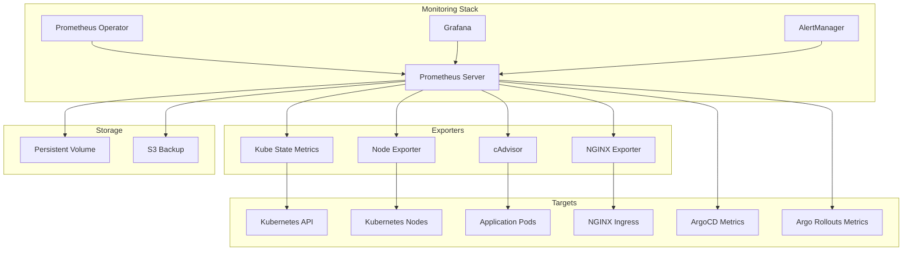

# Observability Stack Deployment (Prometheus & Grafana)

## Overview

This document outlines the deployment and configuration of the observability stack using kube-prometheus-stack, which includes Prometheus, Grafana, Alertmanager, and various exporters. The stack provides comprehensive monitoring for both infrastructure and application metrics.

## Architecture Overview



## Installation Strategy

### 1. Deploy Monitoring Stack Script

Create `scripts/deploy-monitoring.sh`:

```bash
#!/bin/bash
set -euo pipefail

MONITORING_VERSION="55.5.0"
NAMESPACE="monitoring"

echo "🚀 Deploying kube-prometheus-stack ${MONITORING_VERSION}..."

# Create namespace
kubectl create namespace ${NAMESPACE} --dry-run=client -o yaml | kubectl apply -f -

# Add Prometheus community Helm repository
helm repo add prometheus-community https://prometheus-community.github.io/helm-charts
helm repo update

# Install kube-prometheus-stack
echo "📦 Installing kube-prometheus-stack..."
helm upgrade --install kube-prometheus-stack prometheus-community/kube-prometheus-stack \
    --namespace ${NAMESPACE} \
    --version ${MONITORING_VERSION} \
    --values infrastructure/monitoring/values.yaml \
    --wait \
    --timeout 10m

# Apply custom configurations
echo "🔧 Applying custom configurations..."
kubectl apply -f infrastructure/monitoring/config/

# Wait for components to be ready
echo "⏳ Waiting for monitoring components..."
kubectl wait --for=condition=ready pod -l app.kubernetes.io/name=prometheus -n ${NAMESPACE} --timeout=300s
kubectl wait --for=condition=ready pod -l app.kubernetes.io/name=grafana -n ${NAMESPACE} --timeout=300s

# Get Grafana admin password
echo "🔑 Retrieving Grafana admin password..."
GRAFANA_PASSWORD=$(kubectl get secret --namespace ${NAMESPACE} kube-prometheus-stack-grafana -o jsonpath="{.data.admin-password}" | base64 -d)

echo ""
echo "✅ Monitoring stack deployment complete!"
echo ""
echo "📊 Access Information:"
echo "======================"
echo "Grafana URL: http://grafana.local"
echo "Username: admin"
echo "Password: ${GRAFANA_PASSWORD}"
echo ""
echo "Prometheus URL: http://prometheus.local"
echo "AlertManager URL: http://alertmanager.local"
```

### 2. Helm Values Configuration

Create `infrastructure/monitoring/values.yaml`:

```yaml
# kube-prometheus-stack values
fullnameOverride: kube-prometheus-stack

## Prometheus Operator
prometheusOperator:
  enabled: true
  admissionWebhooks:
    enabled: true
    patch:
      enabled: true
  resources:
    limits:
      cpu: 200m
      memory: 256Mi
    requests:
      cpu: 100m
      memory: 128Mi

## Prometheus
prometheus:
  ingress:
    enabled: true
    ingressClassName: nginx
    hosts:
      - prometheus.local
    paths:
      - /
    pathType: Prefix

  prometheusSpec:
    ## Retention period
    retention: 15d
    retentionSize: 10GB

    ## Resource limits
    resources:
      limits:
        cpu: 1000m
        memory: 2Gi
      requests:
        cpu: 500m
        memory: 1Gi

    ## Storage configuration
    storageSpec:
      volumeClaimTemplate:
        spec:
          accessModes: ["ReadWriteOnce"]
          resources:
            requests:
              storage: 20Gi

    ## Service monitors to be selected
    serviceMonitorSelectorNilUsesHelmValues: false
    serviceMonitorSelector: {}
    serviceMonitorNamespaceSelector: {}

    ## Pod monitors to be selected
    podMonitorSelectorNilUsesHelmValues: false
    podMonitorSelector: {}
    podMonitorNamespaceSelector: {}

    ## Rules to be selected
    ruleSelectorNilUsesHelmValues: false
    ruleSelector: {}
    ruleNamespaceSelector: {}

    ## Scrape interval
    scrapeInterval: 30s
    evaluationInterval: 30s

    ## Additional scrape configs
    additionalScrapeConfigs:
      # ArgoCD metrics
      - job_name: "argocd-metrics"
        kubernetes_sd_configs:
          - role: service
            namespaces:
              names: ["argocd"]
        relabel_configs:
          - source_labels: [__meta_kubernetes_service_name]
            regex: argocd-metrics
            action: keep
          - source_labels: [__meta_kubernetes_namespace]
            target_label: namespace
          - source_labels: [__meta_kubernetes_service_name]
            target_label: service

      # Argo Rollouts metrics
      - job_name: "argo-rollouts-metrics"
        kubernetes_sd_configs:
          - role: service
            namespaces:
              names: ["argo-rollouts"]
        relabel_configs:
          - source_labels: [__meta_kubernetes_service_name]
            regex: argo-rollouts-metrics
            action: keep

    ## External labels
    externalLabels:
      cluster: minikube
      environment: development

## Grafana
grafana:
  enabled: true

  ## Admin credentials
  adminPassword: admin # Change in production

  ## Ingress
  ingress:
    enabled: true
    ingressClassName: nginx
    hosts:
      - grafana.local
    path: /
    pathType: Prefix

  ## Resources
  resources:
    limits:
      cpu: 200m
      memory: 256Mi
    requests:
      cpu: 100m
      memory: 128Mi

  ## Persistence
  persistence:
    enabled: true
    size: 2Gi

  ## Sidecar for dashboard/datasource provisioning
  sidecar:
    dashboards:
      enabled: true
      searchNamespace: ALL
      provider:
        foldersFromFilesStructure: true
      annotations:
        k8s-sidecar-target-directory: "/var/lib/grafana/dashboards"
    datasources:
      enabled: true
      defaultDatasourceEnabled: true

  ## Additional datasources
  additionalDataSources:
    - name: Loki
      type: loki
      url: http://loki.monitoring:3100
      access: proxy
      isDefault: false

  ## Dashboard providers
  dashboardProviders:
    dashboardproviders.yaml:
      apiVersion: 1
      providers:
        - name: "default"
          folder: ""
          type: file
          disableDeletion: false
          editable: true
          options:
            path: /var/lib/grafana/dashboards/default
        - name: "custom"
          folder: "Custom"
          type: file
          disableDeletion: false
          editable: true
          options:
            path: /var/lib/grafana/dashboards/custom

  ## Pre-installed dashboards
  dashboards:
    default:
      kubernetes-cluster:
        gnetId: 7249
        revision: 1
        datasource: Prometheus
      nginx-ingress:
        gnetId: 9614
        revision: 1
        datasource: Prometheus

## AlertManager
alertmanager:
  enabled: true

  ingress:
    enabled: true
    ingressClassName: nginx
    hosts:
      - alertmanager.local
    paths:
      - /
    pathType: Prefix

  alertmanagerSpec:
    retention: 120h
    storage:
      volumeClaimTemplate:
        spec:
          accessModes: ["ReadWriteOnce"]
          resources:
            requests:
              storage: 2Gi

    resources:
      limits:
        cpu: 100m
        memory: 128Mi
      requests:
        cpu: 50m
        memory: 64Mi

  ## AlertManager configuration
  config:
    global:
      resolve_timeout: 5m

    route:
      group_by: ["alertname", "cluster", "service"]
      group_wait: 10s
      group_interval: 10s
      repeat_interval: 12h
      receiver: "default"
      routes:
        - receiver: "critical"
          matchers:
            - severity="critical"
        - receiver: "warning"
          matchers:
            - severity="warning"

    receivers:
      - name: "default"
        webhook_configs:
          - url: "http://webhook-handler.default:5001/alerts"

      - name: "critical"
        webhook_configs:
          - url: "http://webhook-handler.default:5001/critical"

      - name: "warning"
        webhook_configs:
          - url: "http://webhook-handler.default:5001/warning"

## Component scraping configurations
kubeApiServer:
  enabled: true

kubelet:
  enabled: true
  serviceMonitor:
    metricRelabelings:
      - sourceLabels: [__name__]
        regex: "kubelet_pod_worker_latency_microseconds|kubelet_pod_start_latency_microseconds|kubelet_cgroup_manager_latency_microseconds"
        action: drop

kubeControllerManager:
  enabled: true

coreDns:
  enabled: true

kubeEtcd:
  enabled: true

kubeScheduler:
  enabled: true

kubeProxy:
  enabled: true

kubeStateMetrics:
  enabled: true

nodeExporter:
  enabled: true

## Additional ServiceMonitors
additionalServiceMonitors:
  - name: ingress-nginx
    selector:
      matchLabels:
        app.kubernetes.io/name: ingress-nginx
    namespaceSelector:
      matchNames:
        - ingress-nginx
    endpoints:
      - port: metrics
        interval: 30s
```

## Custom Dashboards

### 1. Application Dashboard

Create `infrastructure/monitoring/dashboards/app-dashboard.json`:

```json
{
  "annotations": {
    "list": [
      {
        "builtIn": 1,
        "datasource": "-- Grafana --",
        "enable": true,
        "hide": true,
        "iconColor": "rgba(0, 211, 255, 1)",
        "name": "Annotations & Alerts",
        "type": "dashboard"
      }
    ]
  },
  "editable": true,
  "gnetId": null,
  "graphTooltip": 0,
  "id": null,
  "iteration": 1635959737865,
  "links": [],
  "panels": [
    {
      "datasource": "Prometheus",
      "fieldConfig": {
        "defaults": {
          "color": {
            "mode": "palette-classic"
          },
          "custom": {
            "axisLabel": "",
            "axisPlacement": "auto",
            "barAlignment": 0,
            "drawStyle": "line",
            "fillOpacity": 10,
            "gradientMode": "none",
            "hideFrom": {
              "tooltip": false,
              "viz": false,
              "legend": false
            },
            "lineInterpolation": "linear",
            "lineWidth": 1,
            "pointSize": 5,
            "scaleDistribution": {
              "type": "linear"
            },
            "showPoints": "never",
            "spanNulls": false,
            "stacking": {
              "group": "A",
              "mode": "none"
            },
            "thresholdsStyle": {
              "mode": "off"
            }
          },
          "mappings": [],
          "thresholds": {
            "mode": "absolute",
            "steps": [
              {
                "color": "green",
                "value": null
              },
              {
                "color": "red",
                "value": 80
              }
            ]
          },
          "unit": "reqps"
        },
        "overrides": []
      },
      "gridPos": {
        "h": 8,
        "w": 12,
        "x": 0,
        "y": 0
      },
      "id": 2,
      "options": {
        "tooltip": {
          "mode": "single"
        },
        "legend": {
          "calcs": [],
          "displayMode": "list",
          "placement": "bottom"
        }
      },
      "pluginVersion": "8.0.0",
      "targets": [
        {
          "expr": "sum(rate(http_requests_total{app_kubernetes_io_name=\"sample-api\"}[5m])) by (version)",
          "legendFormat": "Version {{version}}",
          "refId": "A"
        }
      ],
      "timeFrom": null,
      "timeShift": null,
      "title": "Request Rate by Version",
      "type": "timeseries"
    },
    {
      "datasource": "Prometheus",
      "fieldConfig": {
        "defaults": {
          "color": {
            "mode": "thresholds"
          },
          "mappings": [],
          "thresholds": {
            "mode": "absolute",
            "steps": [
              {
                "color": "red",
                "value": null
              },
              {
                "color": "yellow",
                "value": 95
              },
              {
                "color": "green",
                "value": 99
              }
            ]
          },
          "unit": "percent"
        },
        "overrides": []
      },
      "gridPos": {
        "h": 8,
        "w": 12,
        "x": 12,
        "y": 0
      },
      "id": 3,
      "options": {
        "orientation": "auto",
        "reduceOptions": {
          "values": false,
          "calcs": ["lastNotNull"],
          "fields": ""
        },
        "showThresholdLabels": false,
        "showThresholdMarkers": true,
        "text": {}
      },
      "pluginVersion": "8.0.0",
      "targets": [
        {
          "expr": "sum(rate(http_requests_total{app_kubernetes_io_name=\"sample-api\",status!~\"5..\"}[5m])) / sum(rate(http_requests_total{app_kubernetes_io_name=\"sample-api\"}[5m])) * 100",
          "refId": "A"
        }
      ],
      "timeFrom": null,
      "timeShift": null,
      "title": "Success Rate",
      "type": "gauge"
    },
    {
      "datasource": "Prometheus",
      "fieldConfig": {
        "defaults": {
          "color": {
            "mode": "palette-classic"
          },
          "custom": {
            "axisLabel": "",
            "axisPlacement": "auto",
            "barAlignment": 0,
            "drawStyle": "line",
            "fillOpacity": 10,
            "gradientMode": "none",
            "hideFrom": {
              "tooltip": false,
              "viz": false,
              "legend": false
            },
            "lineInterpolation": "linear",
            "lineWidth": 1,
            "pointSize": 5,
            "scaleDistribution": {
              "type": "linear"
            },
            "showPoints": "never",
            "spanNulls": false,
            "stacking": {
              "group": "A",
              "mode": "none"
            },
            "thresholdsStyle": {
              "mode": "off"
            }
          },
          "mappings": [],
          "thresholds": {
            "mode": "absolute",
            "steps": [
              {
                "color": "green",
                "value": null
              },
              {
                "color": "red",
                "value": 80
              }
            ]
          },
          "unit": "s"
        },
        "overrides": []
      },
      "gridPos": {
        "h": 8,
        "w": 12,
        "x": 0,
        "y": 8
      },
      "id": 4,
      "options": {
        "tooltip": {
          "mode": "single"
        },
        "legend": {
          "calcs": [],
          "displayMode": "list",
          "placement": "bottom"
        }
      },
      "pluginVersion": "8.0.0",
      "targets": [
        {
          "expr": "histogram_quantile(0.95, sum(rate(http_request_duration_seconds_bucket{app_kubernetes_io_name=\"sample-api\"}[5m])) by (le, version))",
          "legendFormat": "P95 {{version}}",
          "refId": "A"
        },
        {
          "expr": "histogram_quantile(0.99, sum(rate(http_request_duration_seconds_bucket{app_kubernetes_io_name=\"sample-api\"}[5m])) by (le, version))",
          "legendFormat": "P99 {{version}}",
          "refId": "B"
        }
      ],
      "timeFrom": null,
      "timeShift": null,
      "title": "Request Latency Percentiles",
      "type": "timeseries"
    },
    {
      "datasource": "Prometheus",
      "fieldConfig": {
        "defaults": {
          "color": {
            "mode": "palette-classic"
          },
          "custom": {
            "axisLabel": "",
            "axisPlacement": "auto",
            "barAlignment": 0,
            "drawStyle": "line",
            "fillOpacity": 10,
            "gradientMode": "none",
            "hideFrom": {
              "tooltip": false,
              "viz": false,
              "legend": false
            },
            "lineInterpolation": "linear",
            "lineWidth": 1,
            "pointSize": 5,
            "scaleDistribution": {
              "type": "linear"
            },
            "showPoints": "never",
            "spanNulls": false,
            "stacking": {
              "group": "A",
              "mode": "none"
            },
            "thresholdsStyle": {
              "mode": "off"
            }
          },
          "mappings": [],
          "thresholds": {
            "mode": "absolute",
            "steps": [
              {
                "color": "green",
                "value": null
              },
              {
                "color": "red",
                "value": 80
              }
            ]
          },
          "unit": "percent"
        },
        "overrides": []
      },
      "gridPos": {
        "h": 8,
        "w": 12,
        "x": 12,
        "y": 8
      },
      "id": 5,
      "options": {
        "tooltip": {
          "mode": "single"
        },
        "legend": {
          "calcs": [],
          "displayMode": "list",
          "placement": "bottom"
        }
      },
      "pluginVersion": "8.0.0",
      "targets": [
        {
          "expr": "sum(rate(container_cpu_usage_seconds_total{pod=~\"sample-api-.*\"}[5m])) by (pod) * 100",
          "legendFormat": "{{pod}}",
          "refId": "A"
        }
      ],
      "timeFrom": null,
      "timeShift": null,
      "title": "CPU Usage by Pod",
      "type": "timeseries"
    }
  ],
  "refresh": "10s",
  "schemaVersion": 27,
  "style": "dark",
  "tags": ["application", "sample-api"],
  "templating": {
    "list": []
  },
  "time": {
    "from": "now-1h",
    "to": "now"
  },
  "timepicker": {},
  "timezone": "",
  "title": "Sample API Dashboard",
  "uid": "sample-api",
  "version": 0
}
```

### 2. Rollout Dashboard

Create `infrastructure/monitoring/dashboards/rollout-dashboard.yaml`:

```yaml
apiVersion: v1
kind: ConfigMap
metadata:
  name: rollout-dashboard
  namespace: monitoring
  labels:
    grafana_dashboard: "1"
data:
  rollout-dashboard.json: |
    {
      "dashboard": {
        "title": "Argo Rollouts Dashboard",
        "panels": [
          {
            "title": "Active Rollouts",
            "targets": [
              {
                "expr": "count(rollout_info) by (name, namespace, phase)"
              }
            ],
            "gridPos": {
              "h": 8,
              "w": 12,
              "x": 0,
              "y": 0
            }
          },
          {
            "title": "Rollout Phase Distribution",
            "targets": [
              {
                "expr": "sum(rollout_phase) by (phase)"
              }
            ],
            "gridPos": {
              "h": 8,
              "w": 12,
              "x": 12,
              "y": 0
            }
          },
          {
            "title": "Canary Weight Over Time",
            "targets": [
              {
                "expr": "rollout_canary_weight"
              }
            ],
            "gridPos": {
              "h": 8,
              "w": 12,
              "x": 0,
              "y": 8
            }
          },
          {
            "title": "Analysis Run Results",
            "targets": [
              {
                "expr": "analysis_run_metric_phase{phase=\"Successful\"}"
              },
              {
                "expr": "analysis_run_metric_phase{phase=\"Failed\"}"
              }
            ],
            "gridPos": {
              "h": 8,
              "w": 12,
              "x": 12,
              "y": 8
            }
          },
          {
            "title": "Rollout Duration",
            "targets": [
              {
                "expr": "time() - rollout_created_time"
              }
            ],
            "gridPos": {
              "h": 8,
              "w": 24,
              "x": 0,
              "y": 16
            }
          }
        ]
      }
    }
```

## ServiceMonitor Configurations

### 1. Application ServiceMonitor

Create `infrastructure/monitoring/servicemonitors/app-servicemonitor.yaml`:

```yaml
apiVersion: monitoring.coreos.com/v1
kind: ServiceMonitor
metadata:
  name: sample-api
  namespace: sample-app
  labels:
    release: kube-prometheus-stack
spec:
  selector:
    matchLabels:
      app.kubernetes.io/name: sample-api
  endpoints:
    - port: http
      interval: 30s
      path: /metrics
      scheme: http
      metricRelabelings:
        # Add version label from pod
        - sourceLabels: [__meta_kubernetes_pod_label_version]
          targetLabel: version
        # Drop unnecessary metrics
        - sourceLabels: [__name__]
          regex: "python_.*"
          action: drop
```

### 2. ArgoCD ServiceMonitor

Create `infrastructure/monitoring/servicemonitors/argocd-servicemonitor.yaml`:

```yaml
apiVersion: monitoring.coreos.com/v1
kind: ServiceMonitor
metadata:
  name: argocd-metrics
  namespace: argocd
  labels:
    release: kube-prometheus-stack
spec:
  selector:
    matchLabels:
      app.kubernetes.io/name: argocd-metrics
  endpoints:
    - port: metrics
      interval: 30s
---
apiVersion: monitoring.coreos.com/v1
kind: ServiceMonitor
metadata:
  name: argocd-server-metrics
  namespace: argocd
  labels:
    release: kube-prometheus-stack
spec:
  selector:
    matchLabels:
      app.kubernetes.io/name: argocd-server
  endpoints:
    - port: metrics
      interval: 30s
---
apiVersion: monitoring.coreos.com/v1
kind: ServiceMonitor
metadata:
  name: argocd-repo-server-metrics
  namespace: argocd
  labels:
    release: kube-prometheus-stack
spec:
  selector:
    matchLabels:
      app.kubernetes.io/name: argocd-repo-server
  endpoints:
    - port: metrics
      interval: 30s
```

### 3. Rollouts ServiceMonitor

Create `infrastructure/monitoring/servicemonitors/rollouts-servicemonitor.yaml`:

```yaml
apiVersion: monitoring.coreos.com/v1
kind: ServiceMonitor
metadata:
  name: argo-rollouts-metrics
  namespace: argo-rollouts
  labels:
    release: kube-prometheus-stack
spec:
  selector:
    matchLabels:
      app.kubernetes.io/name: argo-rollouts-metrics
  endpoints:
    - port: metrics
      interval: 30s
```

## PrometheusRule Configurations

### 1. Application Alerts

Create `infrastructure/monitoring/alerts/app-alerts.yaml`:

```yaml
apiVersion: monitoring.coreos.com/v1
kind: PrometheusRule
metadata:
  name: sample-api-alerts
  namespace: monitoring
  labels:
    prometheus: kube-prometheus
    role: alert-rules
spec:
  groups:
    - name: sample-api
      interval: 30s
      rules:
        # High error rate
        - alert: HighErrorRate
          expr: |
            sum(rate(http_requests_total{app_kubernetes_io_name="sample-api",status=~"5.."}[5m])) 
            / sum(rate(http_requests_total{app_kubernetes_io_name="sample-api"}[5m])) > 0.05
          for: 5m
          labels:
            severity: critical
            team: platform
          annotations:
            summary: "High error rate detected for {{ $labels.app_kubernetes_io_name }}"
            description: "Error rate is {{ $value | humanizePercentage }} for the last 5 minutes"
            runbook_url: "https://wiki.example.com/runbooks/high-error-rate"

        # High latency
        - alert: HighLatency
          expr: |
            histogram_quantile(0.99, sum(rate(http_request_duration_seconds_bucket{app_kubernetes_io_name="sample-api"}[5m])) by (le)) > 1
          for: 5m
          labels:
            severity: warning
            team: platform
          annotations:
            summary: "High latency detected for {{ $labels.app_kubernetes_io_name }}"
            description: "P99 latency is {{ $value }}s for the last 5 minutes"

        # Pod crash looping
        - alert: PodCrashLooping
          expr: |
            rate(kube_pod_container_status_restarts_total{namespace="sample-app",pod=~"sample-api-.*"}[15m]) > 0
          for: 5m
          labels:
            severity: critical
            team: platform
          annotations:
            summary: "Pod {{ $labels.pod }} is crash looping"
            description: "Pod {{ $labels.pod }} has restarted {{ $value }} times in the last 15 minutes"

        # High memory usage
        - alert: HighMemoryUsage
          expr: |
            sum(container_memory_working_set_bytes{namespace="sample-app",pod=~"sample-api-.*"}) 
            / sum(container_spec_memory_limit_bytes{namespace="sample-app",pod=~"sample-api-.*"}) > 0.9
          for: 5m
          labels:
            severity: warning
            team: platform
          annotations:
            summary: "High memory usage for {{ $labels.pod }}"
            description: "Memory usage is {{ $value | humanizePercentage }} of limit"
```

### 2. Infrastructure Alerts

Create `infrastructure/monitoring/alerts/infra-alerts.yaml`:

```yaml
apiVersion: monitoring.coreos.com/v1
kind: PrometheusRule
metadata:
  name: infrastructure-alerts
  namespace: monitoring
  labels:
    prometheus: kube-prometheus
    role: alert-rules
spec:
  groups:
    - name: kubernetes
      interval: 30s
      rules:
        # Node not ready
        - alert: NodeNotReady
          expr: |
            kube_node_status_condition{condition="Ready",status="true"} == 0
          for: 5m
          labels:
            severity: critical
            team: infrastructure
          annotations:
            summary: "Node {{ $labels.node }} is not ready"
            description: "Node {{ $labels.node }} has been unready for more than 5 minutes"

        # High node CPU
        - alert: NodeHighCPU
          expr: |
            100 - (avg by (instance) (irate(node_cpu_seconds_total{mode="idle"}[5m])) * 100) > 80
          for: 10m
          labels:
            severity: warning
            team: infrastructure
          annotations:
            summary: "High CPU usage on node {{ $labels.instance }}"
            description: "CPU usage is {{ $value }}% on node {{ $labels.instance }}"

        # High node memory
        - alert: NodeHighMemory
          expr: |
            (1 - (node_memory_MemAvailable_bytes / node_memory_MemTotal_bytes)) * 100 > 85
          for: 10m
          labels:
            severity: warning
            team: infrastructure
          annotations:
            summary: "High memory usage on node {{ $labels.instance }}"
            description: "Memory usage is {{ $value }}% on node {{ $labels.instance }}"

        # Disk space low
        - alert: NodeDiskSpaceLow
          expr: |
            (node_filesystem_avail_bytes{mountpoint="/"} / node_filesystem_size_bytes{mountpoint="/"}) * 100 < 15
          for: 5m
          labels:
            severity: warning
            team: infrastructure
          annotations:
            summary: "Low disk space on node {{ $labels.instance }}"
            description: "Only {{ $value }}% disk space left on {{ $labels.instance }}"
```

### 3. Rollout Alerts

Create `infrastructure/monitoring/alerts/rollout-alerts.yaml`:

```yaml
apiVersion: monitoring.coreos.com/v1
kind: PrometheusRule
metadata:
  name: rollout-alerts
  namespace: monitoring
  labels:
    prometheus: kube-prometheus
    role: alert-rules
spec:
  groups:
    - name: rollouts
      interval: 30s
      rules:
        # Rollout stuck
        - alert: RolloutStuck
          expr: |
            time() - rollout_phase_last_transition_time{phase="Paused"} > 3600
          for: 5m
          labels:
            severity: warning
            team: platform
          annotations:
            summary: "Rollout {{ $labels.name }} is stuck in {{ $labels.phase }} phase"
            description: "Rollout has been in {{ $labels.phase }} phase for more than 1 hour"

        # Rollout failed
        - alert: RolloutFailed
          expr: |
            rollout_phase{phase="Error"} == 1
          for: 2m
          labels:
            severity: critical
            team: platform
          annotations:
            summary: "Rollout {{ $labels.name }} has failed"
            description: "Rollout {{ $labels.name }} is in Error phase"

        # Analysis failed
        - alert: AnalysisFailed
          expr: |
            analysis_run_phase{phase="Failed"} == 1
          for: 2m
          labels:
            severity: critical
            team: platform
          annotations:
            summary: "Analysis {{ $labels.name }} has failed"
            description: "Analysis run {{ $labels.name }} has failed, rollout may be aborted"
```

## Grafana Configuration

### 1. Data Sources

Create `infrastructure/monitoring/config/datasources.yaml`:

```yaml
apiVersion: v1
kind: ConfigMap
metadata:
  name: grafana-datasources
  namespace: monitoring
  labels:
    grafana_datasource: "1"
data:
  datasources.yaml: |
    apiVersion: 1
    datasources:
    - name: Prometheus
      type: prometheus
      url: http://kube-prometheus-stack-prometheus:9090
      access: proxy
      isDefault: true
      jsonData:
        timeInterval: 30s
    - name: AlertManager
      type: alertmanager
      url: http://kube-prometheus-stack-alertmanager:9093
      access: proxy
    - name: Loki
      type: loki
      url: http://loki:3100
      access: proxy
```

### 2. Dashboard Provisioning

Create `infrastructure/monitoring/config/dashboard-provider.yaml`:

```yaml
apiVersion: v1
kind: ConfigMap
metadata:
  name: grafana-dashboard-provider
  namespace: monitoring
data:
  provider.yaml: |
    apiVersion: 1
    providers:
    - name: 'default'
      orgId: 1
      folder: ''
      type: file
      disableDeletion: false
      updateIntervalSeconds: 10
      allowUiUpdates: true
      options:
        path: /var/lib/grafana/dashboards
    - name: 'application'
      orgId: 1
      folder: 'Application'
      type: file
      disableDeletion: false
      updateIntervalSeconds: 10
      allowUiUpdates: true
      options:
        path: /var/lib/grafana/dashboards/application
    - name: 'infrastructure'
      orgId: 1
      folder: 'Infrastructure'
      type: file
      disableDeletion: false
      updateIntervalSeconds: 10
      allowUiUpdates: true
      options:
        path: /var/lib/grafana/dashboards/infrastructure
```

## Integration Scripts

### 1. Backup Prometheus Data

Create `scripts/backup-prometheus.sh`:

```bash
#!/bin/bash
set -euo pipefail

NAMESPACE="monitoring"
PROMETHEUS_POD=$(kubectl get pod -n ${NAMESPACE} -l app.kubernetes.io/name=prometheus -o jsonpath="{.items[0].metadata.name}")
BACKUP_DIR="./backups/prometheus/$(date +%Y%m%d_%H%M%S)"

echo "📦 Creating Prometheus backup..."
mkdir -p ${BACKUP_DIR}

# Create snapshot
echo "Creating snapshot..."
kubectl exec -n ${NAMESPACE} ${PROMETHEUS_POD} -c prometheus -- \
    curl -XPOST http://localhost:9090/api/v1/admin/tsdb/snapshot

# Get snapshot name
SNAPSHOT=$(kubectl exec -n ${NAMESPACE} ${PROMETHEUS_POD} -c prometheus -- \
    ls -t /prometheus/snapshots | head -1)

# Copy snapshot
echo "Copying snapshot ${SNAPSHOT}..."
kubectl cp ${NAMESPACE}/${PROMETHEUS_POD}:/prometheus/snapshots/${SNAPSHOT} \
    ${BACKUP_DIR}/${SNAPSHOT} -c prometheus

echo "✅ Backup completed: ${BACKUP_DIR}/${SNAPSHOT}"
```

### 2. Import Dashboards

Create `scripts/import-dashboards.sh`:

```bash
#!/bin/bash
set -euo pipefail

GRAFANA_URL="http://grafana.local"
GRAFANA_USER="admin"
GRAFANA_PASS=$(kubectl get secret -n monitoring kube-prometheus-stack-grafana -o jsonpath="{.data.admin-password}" | base64 -d)
DASHBOARD_DIR="./infrastructure/monitoring/dashboards"

echo "📊 Importing Grafana dashboards..."

for dashboard in ${DASHBOARD_DIR}/*.json; do
    echo "Importing $(basename ${dashboard})..."

    curl -X POST \
        -H "Content-Type: application/json" \
        -u "${GRAFANA_USER}:${GRAFANA_PASS}" \
        -d @${dashboard} \
        ${GRAFANA_URL}/api/dashboards/db
done

echo "✅ Dashboard import completed"
```

## Monitoring Best Practices

### 1. Metrics Collection

1. **Use appropriate scrape intervals**: 30s for most metrics, 60s for less critical
2. **Apply metric relabeling**: Drop unnecessary metrics to reduce storage
3. **Use recording rules**: Pre-compute expensive queries
4. **Set retention policies**: Balance storage vs historical data needs
5. **Monitor cardinality**: Avoid high-cardinality labels

### 2. Dashboard Design

1. **Follow RED method**: Rate, Errors, Duration
2. **Use consistent layouts**: Similar dashboards should look similar
3. **Include relevant context**: Version, environment, deployment info
4. **Set appropriate refresh rates**: Balance freshness vs load
5. **Use variables**: Make dashboards reusable across environments

### 3. Alerting Strategy

1. **Alert on symptoms, not causes**: Focus on user impact
2. **Set appropriate thresholds**: Avoid alert fatigue
3. **Include runbook links**: Help on-call engineers
4. **Use alert routing**: Send to appropriate teams
5. **Test alerts regularly**: Ensure they work when needed

### 4. Resource Management

1. **Set resource limits**: Prevent monitoring from affecting workloads
2. **Use persistent storage**: Don't lose data on pod restarts
3. **Monitor the monitors**: Ensure monitoring stack is healthy
4. **Regular backups**: Protect against data loss
5. **Capacity planning**: Scale before hitting limits

## Troubleshooting

### Common Issues

1. **Metrics not appearing**

   ```bash
   # Check ServiceMonitor is selected
   kubectl get prometheus -n monitoring -o yaml | grep serviceMonitorSelector

   # Verify target is being scraped
   kubectl port-forward -n monitoring svc/kube-prometheus-stack-prometheus 9090
   # Visit http://localhost:9090/targets
   ```

2. **High memory usage**

   ```bash
   # Check cardinality
   curl -s http://prometheus.local/api/v1/label/__name__/values | jq '. | length'

   # Find high cardinality metrics
   curl -s http://prometheus.local/api/v1/query?query=prometheus_tsdb_symbol_table_size_bytes | jq
   ```

3. **Dashboard not loading**

   ```bash
   # Check Grafana logs
   kubectl logs -n monitoring deployment/kube-prometheus-stack-grafana

   # Verify datasource connectivity
   kubectl exec -n monitoring deployment/kube-prometheus-stack-grafana -- \
       curl http://kube-prometheus-stack-prometheus:9090/api/v1/query?query=up
   ```

## Summary

This observability stack provides:

1. **Complete Monitoring Solution**: Prometheus for metrics, Grafana for visualization
2. **Pre-configured Dashboards**: Application, infrastructure, and rollout monitoring
3. **Comprehensive Alerting**: Covering application, infrastructure, and deployment issues
4. **Integration Points**: ServiceMonitors for all components
5. **Operational Scripts**: Backup, restore, and management utilities
6. **Best Practices**: Guidelines for effective monitoring

The stack is designed to provide deep insights into both the application behavior and infrastructure health, enabling quick detection and resolution of issues.
