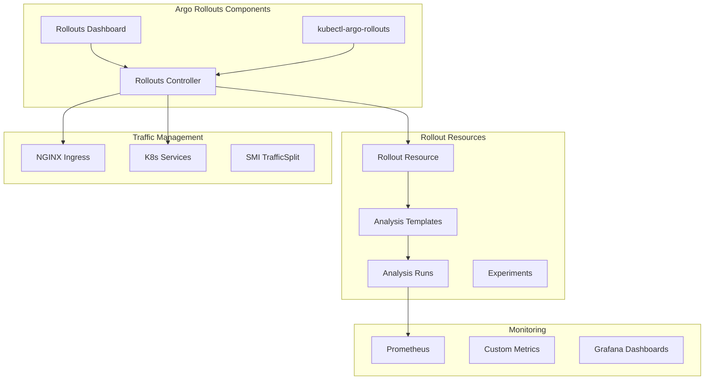

# Argo Rollouts Integration and Strategies

## Overview

This document provides a comprehensive guide for implementing progressive delivery strategies using Argo Rollouts in our Kubernetes environment. We'll cover both Blue/Green and Canary deployment strategies, including traffic management, analysis, and rollback procedures.

## Argo Rollouts Architecture



## Installation and Configuration

### 1. Deploy Argo Rollouts

Create `scripts/deploy-rollouts.sh`:

```bash
#!/bin/bash
set -euo pipefail

ROLLOUTS_VERSION="v1.6.4"
NAMESPACE="argo-rollouts"

echo "🚀 Deploying Argo Rollouts ${ROLLOUTS_VERSION}..."

# Create namespace
kubectl create namespace ${NAMESPACE} --dry-run=client -o yaml | kubectl apply -f -

# Install Argo Rollouts via Helm
helm repo add argo https://argoproj.github.io/argo-helm
helm repo update

helm upgrade --install argo-rollouts argo/argo-rollouts \
    --namespace ${NAMESPACE} \
    --set controller.metrics.enabled=true \
    --set controller.metrics.serviceMonitor.enabled=true \
    --set dashboard.enabled=true \
    --set dashboard.ingress.enabled=true \
    --set dashboard.ingress.hosts[0]=rollouts.local \
    --set dashboard.ingress.ingressClassName=nginx \
    --wait

# Install kubectl plugin
echo "💻 Installing kubectl-argo-rollouts plugin..."
curl -LO https://github.com/argoproj/argo-rollouts/releases/download/${ROLLOUTS_VERSION}/kubectl-argo-rollouts-linux-amd64
chmod +x kubectl-argo-rollouts-linux-amd64
sudo mv kubectl-argo-rollouts-linux-amd64 /usr/local/bin/kubectl-argo-rollouts

echo "✅ Argo Rollouts deployment complete!"
echo "Dashboard available at: http://rollouts.local"
```

### 2. Configure RBAC

Create `infrastructure/rollouts/rbac.yaml`:

```yaml
# ServiceAccount for Argo Rollouts to read metrics
apiVersion: v1
kind: ServiceAccount
metadata:
  name: argo-rollouts-metrics-reader
  namespace: argo-rollouts
---
# ClusterRole for reading metrics
apiVersion: rbac.authorization.k8s.io/v1
kind: ClusterRole
metadata:
  name: argo-rollouts-metrics-reader
rules:
  - apiGroups: [""]
    resources: ["services", "pods"]
    verbs: ["get", "list"]
  - apiGroups: ["apps"]
    resources: ["deployments", "replicasets"]
    verbs: ["get", "list"]
  - apiGroups: ["argoproj.io"]
    resources: ["rollouts", "analysisruns", "experiments"]
    verbs: ["get", "list", "watch"]
---
# ClusterRoleBinding
apiVersion: rbac.authorization.k8s.io/v1
kind: ClusterRoleBinding
metadata:
  name: argo-rollouts-metrics-reader
roleRef:
  apiGroup: rbac.authorization.k8s.io
  kind: ClusterRole
  name: argo-rollouts-metrics-reader
subjects:
  - kind: ServiceAccount
    name: argo-rollouts-metrics-reader
    namespace: argo-rollouts
```

## Blue/Green Deployment Strategy

### 1. Strategy Overview

Blue/Green deployment maintains two complete environments:

- **Blue**: Current production version
- **Green**: New version being deployed

Traffic switches instantly from Blue to Green after validation.

### 2. Blue/Green Rollout Configuration

Create `charts/sample-api/rollout-strategies/blue-green.yaml`:

```yaml
apiVersion: argoproj.io/v1alpha1
kind: Rollout
metadata:
  name: {{ include "sample-api.fullname" . }}
spec:
  replicas: {{ .Values.rollout.replicas }}
  selector:
    matchLabels:
      app: {{ include "sample-api.name" . }}
  template:
    metadata:
      labels:
        app: {{ include "sample-api.name" . }}
        version: {{ .Chart.AppVersion }}
    spec:
      containers:
      - name: {{ .Chart.Name }}
        image: {{ include "sample-api.image" . }}
        ports:
        - containerPort: 8000
        # ... rest of container spec
  strategy:
    blueGreen:
      # Service that always points to active version
      activeService: {{ include "sample-api.fullname" . }}-active

      # Service for preview/testing
      previewService: {{ include "sample-api.fullname" . }}-preview

      # Automatic promotion configuration
      autoPromotionEnabled: {{ .Values.rollout.blueGreen.autoPromotionEnabled }}

      # Time to wait before scaling down old version
      scaleDownDelaySeconds: {{ .Values.rollout.blueGreen.scaleDownDelaySeconds }}

      # Revert to previous version on promotion failure
      abortScaleDownDelaySeconds: 30

      # Pre-promotion analysis
      prePromotionAnalysis:
        templates:
        - templateName: smoke-tests
        - templateName: load-test
        args:
        - name: service-name
          value: {{ include "sample-api.fullname" . }}-preview

      # Post-promotion analysis
      postPromotionAnalysis:
        templates:
        - templateName: success-rate
        - templateName: error-rate
        args:
        - name: service-name
          value: {{ include "sample-api.fullname" . }}-active
```

### 3. Blue/Green Services

```yaml
# Active Service (Production Traffic)
apiVersion: v1
kind: Service
metadata:
  name: {{ include "sample-api.fullname" . }}-active
spec:
  selector:
    app: {{ include "sample-api.name" . }}
  ports:
  - port: 80
    targetPort: 8000
---
# Preview Service (Testing)
apiVersion: v1
kind: Service
metadata:
  name: {{ include "sample-api.fullname" . }}-preview
spec:
  selector:
    app: {{ include "sample-api.name" . }}
  ports:
  - port: 80
    targetPort: 8000
```

### 4. Blue/Green Analysis Templates

Create `infrastructure/rollouts/analysis-templates/blue-green.yaml`:

```yaml
# Smoke test analysis
apiVersion: argoproj.io/v1alpha1
kind: AnalysisTemplate
metadata:
  name: smoke-tests
spec:
  args:
    - name: service-name
  metrics:
    - name: smoke-test
      count: 5
      interval: 10s
      successCondition: result == "true"
      provider:
        web:
          url: "http://{{ args.service-name }}/health/ready"
          jsonPath: "{$.status}"
---
# Load test analysis
apiVersion: argoproj.io/v1alpha1
kind: AnalysisTemplate
metadata:
  name: load-test
spec:
  args:
    - name: service-name
  metrics:
    - name: load-test-latency
      count: 3
      interval: 30s
      successCondition: result < 500
      provider:
        job:
          spec:
            template:
              spec:
                containers:
                  - name: load-tester
                    image: grafana/k6:latest
                    command: ["k6", "run", "-"]
                    stdin: |
                      import http from 'k6/http';
                      import { check } from 'k6';

                      export let options = {
                        stages: [
                          { duration: '30s', target: 100 },
                          { duration: '1m', target: 100 },
                          { duration: '30s', target: 0 },
                        ],
                        thresholds: {
                          http_req_duration: ['p(95)<500'],
                        },
                      };

                      export default function() {
                        let res = http.get('http://{{ args.service-name }}');
                        check(res, {
                          'status is 200': (r) => r.status === 200,
                        });
                      }
                restartPolicy: Never
```

## Canary Deployment Strategy

### 1. Strategy Overview

Canary deployment gradually shifts traffic from the stable version to the new version:

- Start with a small percentage (e.g., 5%)
- Monitor metrics and error rates
- Gradually increase traffic if healthy
- Rollback automatically if issues detected

### 2. Canary Rollout Configuration

Create `charts/sample-api/rollout-strategies/canary.yaml`:

```yaml
apiVersion: argoproj.io/v1alpha1
kind: Rollout
metadata:
  name: {{ include "sample-api.fullname" . }}
spec:
  replicas: {{ .Values.rollout.replicas }}
  selector:
    matchLabels:
      app: {{ include "sample-api.name" . }}
  template:
    metadata:
      labels:
        app: {{ include "sample-api.name" . }}
        version: {{ .Chart.AppVersion }}
    spec:
      containers:
      - name: {{ .Chart.Name }}
        image: {{ include "sample-api.image" . }}
        ports:
        - containerPort: 8000
        # ... rest of container spec
  strategy:
    canary:
      # Services
      stableService: {{ include "sample-api.fullname" . }}-stable
      canaryService: {{ include "sample-api.fullname" . }}-canary

      # Traffic routing via NGINX
      trafficRouting:
        nginx:
          stableIngress: {{ include "sample-api.fullname" . }}
          additionalIngressAnnotations:
            canary-by-header: X-Canary
            canary-by-header-value: "true"

      # Maximum number of pods that can be unavailable
      maxUnavailable: 1

      # Maximum number of pods that can be created over desired replicas
      maxSurge: "25%"

      # Canary deployment steps
      steps:
      # Step 1: Deploy canary with 10% traffic
      - setWeight: 10
      - pause:
          duration: 2m

      # Step 2: Analysis at 10%
      - analysis:
          templates:
          - templateName: success-rate
            clusterScope: true
          - templateName: latency-p99
            clusterScope: true
          args:
          - name: service-name
            value: {{ include "sample-api.fullname" . }}-canary

      # Step 3: Increase to 25%
      - setWeight: 25
      - pause:
          duration: 2m

      # Step 4: Analysis at 25%
      - analysis:
          templates:
          - templateName: success-rate
            clusterScope: true
          - templateName: error-logs
            clusterScope: true

      # Step 5: Increase to 50%
      - setWeight: 50
      - pause:
          duration: 5m

      # Step 6: Final analysis at 50%
      - analysis:
          templates:
          - templateName: success-rate
            clusterScope: true
          - templateName: latency-p99
            clusterScope: true
          - templateName: cpu-usage
            clusterScope: true

      # Step 7: Full rollout
      - setWeight: 100
      - pause:
          duration: 10m

      # Anti-affinity to spread canary pods
      antiAffinity:
        preferredDuringSchedulingIgnoredDuringExecution:
          weight: 100
```

### 3. Canary Analysis Templates

Create `infrastructure/rollouts/analysis-templates/canary.yaml`:

```yaml
# Success rate analysis
apiVersion: argoproj.io/v1alpha1
kind: AnalysisTemplate
metadata:
  name: success-rate
  namespace: argo-rollouts
spec:
  args:
    - name: service-name
    - name: namespace
      value: sample-app
  metrics:
    - name: success-rate
      interval: 30s
      count: 10
      successCondition: result[0] >= 95
      failureCondition: result[0] < 90
      failureLimit: 3
      provider:
        prometheus:
          address: http://kube-prometheus-stack-prometheus.monitoring:9090
          query: |
            sum(rate(
              http_requests_total{
                app_kubernetes_io_name="sample-api",
                namespace="{{ args.namespace }}",
                status!~"5.."
              }[2m]
            )) by (version) / 
            sum(rate(
              http_requests_total{
                app_kubernetes_io_name="sample-api",
                namespace="{{ args.namespace }}"
              }[2m]
            )) by (version) * 100
---
# P99 latency analysis
apiVersion: argoproj.io/v1alpha1
kind: AnalysisTemplate
metadata:
  name: latency-p99
  namespace: argo-rollouts
spec:
  args:
    - name: service-name
    - name: namespace
      value: sample-app
  metrics:
    - name: latency-p99
      interval: 30s
      count: 10
      successCondition: result[0] <= 0.5
      failureCondition: result[0] > 1.0
      failureLimit: 3
      provider:
        prometheus:
          address: http://kube-prometheus-stack-prometheus.monitoring:9090
          query: |
            histogram_quantile(0.99,
              sum(rate(
                http_request_duration_seconds_bucket{
                  app_kubernetes_io_name="sample-api",
                  namespace="{{ args.namespace }}",
                  version="canary"
                }[2m]
              )) by (le)
            )
---
# Error logs analysis
apiVersion: argoproj.io/v1alpha1
kind: AnalysisTemplate
metadata:
  name: error-logs
  namespace: argo-rollouts
spec:
  args:
    - name: namespace
      value: sample-app
  metrics:
    - name: error-count
      interval: 30s
      count: 10
      successCondition: result[0] <= 10
      failureCondition: result[0] > 50
      failureLimit: 2
      provider:
        prometheus:
          address: http://kube-prometheus-stack-prometheus.monitoring:9090
          query: |
            sum(rate(
              app_errors_total{
                app_kubernetes_io_name="sample-api",
                namespace="{{ args.namespace }}",
                version="canary"
              }[5m]
            ))
---
# CPU usage analysis
apiVersion: argoproj.io/v1alpha1
kind: AnalysisTemplate
metadata:
  name: cpu-usage
  namespace: argo-rollouts
spec:
  args:
    - name: namespace
      value: sample-app
  metrics:
    - name: cpu-usage
      interval: 30s
      count: 10
      successCondition: result[0] <= 80
      failureCondition: result[0] > 90
      failureLimit: 3
      provider:
        prometheus:
          address: http://kube-prometheus-stack-prometheus.monitoring:9090
          query: |
            avg(
              rate(container_cpu_usage_seconds_total{
                namespace="{{ args.namespace }}",
                pod=~".*sample-api.*",
                container="sample-api"
              }[2m]) * 100
            )
```

### 4. Traffic Management Configuration

Create `infrastructure/rollouts/traffic-management.yaml`:

```yaml
# Canary Ingress configuration
apiVersion: networking.k8s.io/v1
kind: Ingress
metadata:
  name: {{ include "sample-api.fullname" . }}-canary
  annotations:
    nginx.ingress.kubernetes.io/canary: "true"
    nginx.ingress.kubernetes.io/canary-weight: "0"
spec:
  ingressClassName: nginx
  rules:
  - host: app.local
    http:
      paths:
      - path: /
        pathType: Prefix
        backend:
          service:
            name: {{ include "sample-api.fullname" . }}-canary
            port:
              number: 80
```

## Advanced Features

### 1. Experiments

Create `infrastructure/rollouts/experiments/ab-testing.yaml`:

```yaml
apiVersion: argoproj.io/v1alpha1
kind: Experiment
metadata:
  name: sample-api-experiment
spec:
  duration: 1h
  progressDeadlineSeconds: 600
  templates:
    - name: baseline
      selector:
        matchLabels:
          app: sample-api
          version: stable
      replicas: 1
      spec:
        containers:
          - name: sample-api
            image: sample-api:v1.0.0
            ports:
              - containerPort: 8000
    - name: canary
      selector:
        matchLabels:
          app: sample-api
          version: canary
      replicas: 1
      spec:
        containers:
          - name: sample-api
            image: sample-api:v2.0.0
            ports:
              - containerPort: 8000
  analyses:
    - name: experiment-analysis
      templateName: ab-test-analysis
      args:
        - name: baseline-hash
          valueFrom:
            podTemplateHashValue: baseline
        - name: canary-hash
          valueFrom:
            podTemplateHashValue: canary
```

### 2. Notification Configuration

Create `infrastructure/rollouts/notifications.yaml`:

```yaml
apiVersion: v1
kind: ConfigMap
metadata:
  name: argo-rollouts-notification-configmap
  namespace: argo-rollouts
data:
  service.webhook: |
    url: http://webhook-handler.default.svc.cluster.local/rollouts
    headers:
    - name: Content-Type
      value: application/json

  template.rollout-completed: |
    webhook:
      rollouts:
        method: POST
        body: |
          {
            "rollout": "{{.rollout.metadata.name}}",
            "namespace": "{{.rollout.metadata.namespace}}",
            "status": "completed",
            "version": "{{.rollout.spec.template.metadata.labels.version}}"
          }

  template.rollout-aborted: |
    webhook:
      rollouts:
        method: POST
        body: |
          {
            "rollout": "{{.rollout.metadata.name}}",
            "namespace": "{{.rollout.metadata.namespace}}",
            "status": "aborted",
            "message": "{{.rollout.status.message}}"
          }

  trigger.on-rollout-completed: |
    - when: rollout.status.phase == 'Healthy'
      send: [rollout-completed]

  trigger.on-rollout-aborted: |
    - when: rollout.status.abort == true
      send: [rollout-aborted]
```

### 3. Progressive Delivery with Feature Flags

Create `infrastructure/rollouts/feature-flags.yaml`:

```yaml
apiVersion: v1
kind: ConfigMap
metadata:
  name: feature-flags
  namespace: sample-app
data:
  flags.yaml: |
    features:
      new-ui:
        enabled: false
        rollout-percentage: 0
      enhanced-api:
        enabled: true
        rollout-percentage: 100
      experimental-feature:
        enabled: true
        rollout-percentage: 10
        allowed-users:
          - test@example.com
          - beta@example.com
```

## Operational Procedures

### 1. Deployment Workflow

Create `scripts/deploy-with-rollout.sh`:

```bash
#!/bin/bash
set -euo pipefail

NAMESPACE="sample-app"
APP_NAME="sample-api"
NEW_VERSION="${1:-}"

if [ -z "$NEW_VERSION" ]; then
    echo "Usage: $0 <new-version>"
    exit 1
fi

echo "🚀 Starting deployment of ${APP_NAME} version ${NEW_VERSION}"

# Update image tag
echo "📝 Updating Helm values..."
helm upgrade ${APP_NAME} ./charts/${APP_NAME} \
    --namespace ${NAMESPACE} \
    --reuse-values \
    --set image.tag=${NEW_VERSION}

# Monitor rollout
echo "📊 Monitoring rollout progress..."
kubectl argo rollouts get rollout ${APP_NAME} -n ${NAMESPACE} --watch
```

### 2. Manual Promotion

```bash
# Promote a paused rollout
kubectl argo rollouts promote sample-api -n sample-app

# Skip current step
kubectl argo rollouts promote sample-api --skip-current-step -n sample-app

# Skip all remaining steps
kubectl argo rollouts promote sample-api --full -n sample-app
```

### 3. Rollback Procedures

Create `scripts/rollback.sh`:

```bash
#!/bin/bash
set -euo pipefail

NAMESPACE="sample-app"
APP_NAME="sample-api"

echo "⚠️  Starting rollback of ${APP_NAME}"

# Abort current rollout
kubectl argo rollouts abort ${APP_NAME} -n ${NAMESPACE}

# Undo to previous version
kubectl argo rollouts undo ${APP_NAME} -n ${NAMESPACE}

# Or rollback to specific revision
# kubectl argo rollouts undo ${APP_NAME} -n ${NAMESPACE} --to-revision=3

echo "✅ Rollback completed"
```

### 4. Traffic Shifting Commands

```bash
# Manually set canary weight
kubectl argo rollouts set weight sample-api 20 -n sample-app

# Pause rollout
kubectl argo rollouts pause sample-api -n sample-app

# Resume rollout
kubectl argo rollouts resume sample-api -n sample-app

# Restart pods
kubectl argo rollouts restart sample-api -n sample-app
```

## Monitoring and Dashboards

### 1. Rollout Status CLI

```bash
# Get rollout status
kubectl argo rollouts get rollout sample-api -n sample-app

# List all rollouts
kubectl argo rollouts list rollouts -n sample-app

# Watch rollout progress
kubectl argo rollouts get rollout sample-api -n sample-app --watch

# Get rollout history
kubectl argo rollouts history sample-api -n sample-app
```

### 2. Grafana Dashboard Configuration

Create `infrastructure/monitoring/dashboards/rollouts-dashboard.json`:

```json
{
  "dashboard": {
    "title": "Argo Rollouts Dashboard",
    "panels": [
      {
        "title": "Rollout Status",
        "targets": [
          {
            "expr": "rollout_info{namespace=\"sample-app\"}"
          }
        ]
      },
      {
        "title": "Canary vs Stable Traffic",
        "targets": [
          {
            "expr": "sum(rate(nginx_ingress_controller_requests{service=~\".*sample-api.*\"}[2m])) by (service)"
          }
        ]
      },
      {
        "title": "Analysis Run Results",
        "targets": [
          {
            "expr": "analysis_run_metric_phase{namespace=\"sample-app\"}"
          }
        ]
      },
      {
        "title": "Rollout Duration",
        "targets": [
          {
            "expr": "time() - rollout_created_time{namespace=\"sample-app\"}"
          }
        ]
      }
    ]
  }
}
```

### 3. Prometheus Rules

Create `infrastructure/monitoring/alerts/rollout-alerts.yaml`:

```yaml
apiVersion: monitoring.coreos.com/v1
kind: PrometheusRule
metadata:
  name: rollout-alerts
  namespace: monitoring
spec:
  groups:
    - name: rollouts
      interval: 30s
      rules:
        - alert: RolloutStalled
          expr: |
            rollout_phase{phase="Paused"} == 1
            and time() - rollout_phase_last_transition_time > 3600
          for: 5m
          labels:
            severity: warning
          annotations:
            summary: "Rollout {{ $labels.name }} has been paused for over 1 hour"

        - alert: RolloutFailed
          expr: |
            rollout_phase{phase="Error"} == 1
          for: 5m
          labels:
            severity: critical
          annotations:
            summary: "Rollout {{ $labels.name }} has failed"

        - alert: AnalysisRunFailed
          expr: |
            analysis_run_phase{phase="Failed"} == 1
          for: 2m
          labels:
            severity: critical
          annotations:
            summary: "Analysis run {{ $labels.name }} has failed"

        - alert: HighCanaryErrorRate
          expr: |
            sum(rate(http_requests_total{version="canary",status=~"5.."}[5m])) /
            sum(rate(http_requests_total{version="canary"}[5m])) > 0.05
          for: 5m
          labels:
            severity: critical
          annotations:
            summary: "Canary deployment has error rate above 5%"
```

## Best Practices

### 1. Strategy Selection Guidelines

**Use Blue/Green when:**

- You need instant rollback capability
- Your application doesn't support running multiple versions
- You have sufficient resources for two complete environments
- Testing can be done effectively on preview traffic

**Use Canary when:**

- You want to minimize risk by gradual rollout
- You need real production traffic for validation
- Your application supports multiple versions running simultaneously
- You want to test with a subset of users first

### 2. Analysis Configuration Best Practices

1. **Set Appropriate Thresholds**: Don't make success conditions too strict
2. **Use Multiple Metrics**: Combine success rate, latency, and error metrics
3. **Include Business Metrics**: Not just technical metrics
4. **Set Proper Intervals**: Allow enough time for metrics to stabilize
5. **Use Failure Limits**: Don't fail on single bad measurement

### 3. Rollout Configuration Best Practices

1. **Start Small**: Begin with small traffic percentages
2. **Pause Between Steps**: Allow time for observation
3. **Use Analysis**: Automate decision making with metrics
4. **Set Resource Limits**: Prevent resource exhaustion
5. **Configure Anti-Affinity**: Spread canary pods across nodes

### 4. Monitoring Best Practices

1. **Track Key Metrics**: Success rate, latency, errors, and business KPIs
2. **Set Up Alerts**: For failed rollouts and degraded performance
3. **Use Dashboards**: Visualize rollout progress and health
4. **Log Analysis**: Include log-based metrics in analysis
5. **Compare Versions**: Always compare canary to stable

## Troubleshooting

### Common Issues and Solutions

1. **Rollout Stuck in Paused State**

   ```bash
   # Check analysis runs
   kubectl get analysisrun -n sample-app

   # Check for failed analysis
   kubectl describe analysisrun <name> -n sample-app

   # Force promotion if needed
   kubectl argo rollouts promote sample-api --full -n sample-app
   ```

2. **Traffic Not Shifting**

   ```bash
   # Check ingress annotations
   kubectl get ingress -n sample-app -o yaml

   # Verify NGINX configuration
   kubectl exec -n ingress-nginx <nginx-pod> -- cat /etc/nginx/nginx.conf | grep sample-api
   ```

3. **Analysis Failing**

   ```bash
   # Check Prometheus connectivity
   kubectl exec -n argo-rollouts <rollouts-pod> -- curl http://kube-prometheus-stack-prometheus.monitoring:9090/api/v1/query

   # Verify metrics exist
   curl http://prometheus.local/api/v1/query?query=http_requests_total
   ```

## Summary

This comprehensive Argo Rollouts strategy provides:

1. **Multiple Deployment Strategies**: Both Blue/Green and Canary with full configuration
2. **Automated Analysis**: Prometheus-based metrics for automatic promotion/rollback
3. **Traffic Management**: Integration with NGINX for gradual traffic shifting
4. **Operational Procedures**: Scripts and commands for day-to-day operations
5. **Monitoring Integration**: Dashboards, alerts, and metrics
6. **Best Practices**: Guidelines for successful progressive delivery

The implementation ensures safe, automated deployments with the ability to quickly rollback when issues are detected.
