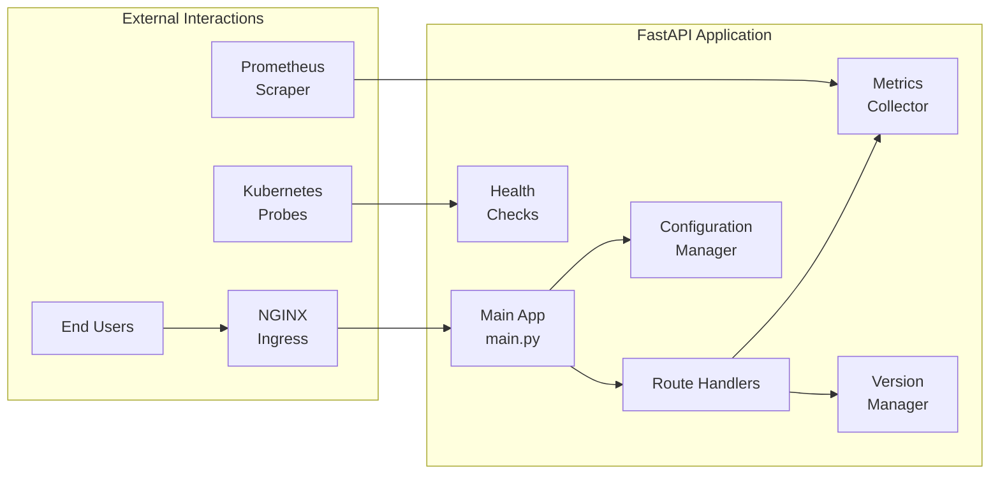

# Sample Application Architecture and Implementation Plan

## Overview

The sample application is a FastAPI-based microservice designed to demonstrate GitOps workflows, progressive delivery strategies, and observability. It provides various endpoints for testing different deployment scenarios.

## Application Architecture



## Core Components

### 1. Application Structure

```
apps/sample-api/
├── app/
│   ├── __init__.py
│   ├── main.py              # FastAPI application entry point
│   ├── config.py            # Configuration management
│   ├── dependencies.py      # Dependency injection
│   ├── middleware.py        # Custom middleware
│   ├── metrics.py           # Prometheus metrics
│   ├── version.py           # Version management
│   ├── core/
│   │   ├── __init__.py
│   │   ├── health.py        # Health check logic
│   │   └── errors.py        # Error handling
│   ├── routes/
│   │   ├── __init__.py
│   │   ├── root.py          # Root endpoints
│   │   ├── health.py        # Health endpoints
│   │   ├── info.py          # Information endpoints
│   │   └── demo.py          # Demo/test endpoints
│   ├── models/
│   │   ├── __init__.py
│   │   ├── health.py        # Health check models
│   │   └── info.py          # Information models
│   ├── templates/
│   │   ├── base.html
│   │   ├── index.html
│   │   └── version.html
│   └── static/
│       ├── css/
│       │   └── style.css
│       └── js/
│           └── app.js
├── tests/
│   ├── __init__.py
│   ├── conftest.py          # Pytest fixtures
│   ├── test_api.py          # API tests
│   ├── test_health.py       # Health check tests
│   └── test_metrics.py      # Metrics tests
├── Dockerfile
├── requirements.txt
├── requirements-dev.txt
├── .dockerignore
├── pytest.ini
└── README.md
```

### 2. Main Application Implementation

**app/main.py**:

```python
from fastapi import FastAPI
from fastapi.middleware.cors import CORSMiddleware
from fastapi.staticfiles import StaticFiles
from contextlib import asynccontextmanager
import uvicorn

from app.config import settings
from app.middleware import RequestMetricsMiddleware
from app.metrics import metrics_registry
from app.routes import health, info, demo, root
from app.version import version_info

# Lifespan context manager for startup/shutdown
@asynccontextmanager
async def lifespan(app: FastAPI):
    # Startup
    print(f"Starting {settings.APP_NAME} v{version_info.version}")
    metrics_registry.initialize()
    yield
    # Shutdown
    print("Shutting down...")

# Create FastAPI app
app = FastAPI(
    title=settings.APP_NAME,
    description="Sample API for K8s Observable Rollouts Demo",
    version=version_info.version,
    docs_url="/docs",
    redoc_url="/redoc",
    openapi_url="/openapi.json",
    lifespan=lifespan
)

# Add middleware
app.add_middleware(
    CORSMiddleware,
    allow_origins=["*"],
    allow_credentials=True,
    allow_methods=["*"],
    allow_headers=["*"],
)
app.add_middleware(RequestMetricsMiddleware)

# Mount static files
app.mount("/static", StaticFiles(directory="app/static"), name="static")

# Include routers
app.include_router(root.router)
app.include_router(health.router, prefix="/health", tags=["health"])
app.include_router(info.router, prefix="/api", tags=["info"])
app.include_router(demo.router, prefix="/demo", tags=["demo"])

if __name__ == "__main__":
    uvicorn.run(
        "app.main:app",
        host="0.0.0.0",
        port=settings.PORT,
        reload=settings.DEBUG,
        log_level=settings.LOG_LEVEL.lower()
    )
```

### 3. Configuration Management

**app/config.py**:

```python
from pydantic_settings import BaseSettings
from typing import Optional
import os

class Settings(BaseSettings):
    # Application settings
    APP_NAME: str = "Sample API"
    APP_ENV: str = "development"
    DEBUG: bool = False
    PORT: int = 8000
    LOG_LEVEL: str = "INFO"

    # Version information
    VERSION: str = "1.0.0"
    BUILD_NUMBER: Optional[str] = None
    GIT_COMMIT: Optional[str] = None

    # Feature flags
    ENABLE_SLOW_ENDPOINT: bool = True
    SLOW_ENDPOINT_DELAY: int = 5
    ERROR_RATE: float = 0.0  # Percentage of requests to fail (0-100)

    # Monitoring
    METRICS_PATH: str = "/metrics"

    # Database (for future use)
    DATABASE_URL: Optional[str] = None

    class Config:
        env_file = ".env"
        env_file_encoding = "utf-8"
        case_sensitive = True

settings = Settings()
```

### 4. Prometheus Metrics Integration

**app/metrics.py**:

```python
from prometheus_client import Counter, Histogram, Gauge, Info, REGISTRY
from prometheus_client import generate_latest
import time
from typing import Dict, Any

class MetricsRegistry:
    def __init__(self):
        # Request metrics
        self.request_count = Counter(
            'http_requests_total',
            'Total HTTP requests',
            ['method', 'endpoint', 'status']
        )

        self.request_duration = Histogram(
            'http_request_duration_seconds',
            'HTTP request duration in seconds',
            ['method', 'endpoint']
        )

        self.request_size = Histogram(
            'http_request_size_bytes',
            'HTTP request size in bytes',
            ['method', 'endpoint']
        )

        self.response_size = Histogram(
            'http_response_size_bytes',
            'HTTP response size in bytes',
            ['method', 'endpoint']
        )

        # Application metrics
        self.error_count = Counter(
            'app_errors_total',
            'Total application errors',
            ['error_type']
        )

        self.active_requests = Gauge(
            'http_requests_active',
            'Number of active HTTP requests'
        )

        # Version info
        self.version_info = Info(
            'app_version',
            'Application version information'
        )

        # Business metrics
        self.business_operations = Counter(
            'business_operations_total',
            'Total business operations',
            ['operation', 'status']
        )

    def initialize(self):
        """Initialize metrics with default values"""
        from app.version import version_info
        self.version_info.info({
            'version': version_info.version,
            'build': version_info.build_number or 'unknown',
            'commit': version_info.git_commit or 'unknown'
        })

    def track_request(self, method: str, endpoint: str, status: int, duration: float,
                     request_size: int, response_size: int):
        """Track HTTP request metrics"""
        self.request_count.labels(method=method, endpoint=endpoint, status=status).inc()
        self.request_duration.labels(method=method, endpoint=endpoint).observe(duration)
        self.request_size.labels(method=method, endpoint=endpoint).observe(request_size)
        self.response_size.labels(method=method, endpoint=endpoint).observe(response_size)

    def track_error(self, error_type: str):
        """Track application errors"""
        self.error_count.labels(error_type=error_type).inc()

    def get_metrics(self) -> bytes:
        """Generate Prometheus metrics"""
        return generate_latest(REGISTRY)

metrics_registry = MetricsRegistry()
```

### 5. Health Check Implementation

**app/routes/health.py**:

```python
from fastapi import APIRouter, Response, status
from typing import Dict
import psutil
import os
from datetime import datetime

from app.models.health import HealthStatus, HealthCheck, ReadinessCheck
from app.config import settings

router = APIRouter()

@router.get("/live", response_model=HealthStatus)
async def liveness():
    """
    Kubernetes liveness probe endpoint.
    Returns 200 if the application is alive.
    """
    return HealthStatus(
        status="healthy",
        timestamp=datetime.utcnow().isoformat(),
        version=settings.VERSION
    )

@router.get("/ready", response_model=ReadinessCheck)
async def readiness(response: Response):
    """
    Kubernetes readiness probe endpoint.
    Checks if the application is ready to serve traffic.
    """
    checks = {
        "memory": check_memory(),
        "disk": check_disk(),
        "config": check_configuration()
    }

    # If any check fails, return 503
    if not all(check["healthy"] for check in checks.values()):
        response.status_code = status.HTTP_503_SERVICE_UNAVAILABLE

    return ReadinessCheck(
        status="ready" if response.status_code == 200 else "not_ready",
        timestamp=datetime.utcnow().isoformat(),
        version=settings.VERSION,
        checks=checks
    )

@router.get("/startup", response_model=HealthStatus)
async def startup():
    """
    Kubernetes startup probe endpoint.
    Used for slow-starting containers.
    """
    # Add any startup checks here
    return HealthStatus(
        status="started",
        timestamp=datetime.utcnow().isoformat(),
        version=settings.VERSION
    )

def check_memory() -> Dict[str, any]:
    """Check if memory usage is within acceptable limits"""
    memory = psutil.virtual_memory()
    healthy = memory.percent < 90
    return {
        "healthy": healthy,
        "message": f"Memory usage: {memory.percent}%",
        "details": {
            "total": memory.total,
            "available": memory.available,
            "percent": memory.percent
        }
    }

def check_disk() -> Dict[str, any]:
    """Check if disk usage is within acceptable limits"""
    disk = psutil.disk_usage('/')
    healthy = disk.percent < 90
    return {
        "healthy": healthy,
        "message": f"Disk usage: {disk.percent}%",
        "details": {
            "total": disk.total,
            "free": disk.free,
            "percent": disk.percent
        }
    }

def check_configuration() -> Dict[str, any]:
    """Check if required configuration is present"""
    required_vars = ["APP_NAME", "APP_ENV", "VERSION"]
    missing = [var for var in required_vars if not getattr(settings, var, None)]
    healthy = len(missing) == 0
    return {
        "healthy": healthy,
        "message": "Configuration OK" if healthy else f"Missing: {missing}",
        "details": {
            "app_env": settings.APP_ENV,
            "debug": settings.DEBUG
        }
    }
```

### 6. Information Endpoints

**app/routes/info.py**:

```python
from fastapi import APIRouter
from fastapi.responses import HTMLResponse
from datetime import datetime
import json

from app.models.info import VersionInfo, AppInfo
from app.config import settings
from app.version import version_info, changelog

router = APIRouter()

@router.get("/version", response_model=VersionInfo)
async def get_version():
    """Return application version information"""
    return VersionInfo(
        version=version_info.version,
        build_number=version_info.build_number,
        git_commit=version_info.git_commit,
        git_branch=version_info.git_branch,
        build_time=version_info.build_time,
        environment=settings.APP_ENV
    )

@router.get("/info", response_model=AppInfo)
async def get_info():
    """Return comprehensive application information"""
    return AppInfo(
        name=settings.APP_NAME,
        version=version_info.version,
        environment=settings.APP_ENV,
        uptime=get_uptime(),
        features={
            "slow_endpoint": settings.ENABLE_SLOW_ENDPOINT,
            "metrics": True,
            "health_checks": True
        },
        links={
            "health": "/health/ready",
            "metrics": settings.METRICS_PATH,
            "docs": "/docs",
            "version_page": "/html"
        }
    )

@router.get("/changelog")
async def get_changelog():
    """Return application changelog"""
    return {
        "version": version_info.version,
        "changes": changelog.get_changes(version_info.version)
    }

def get_uptime() -> str:
    """Calculate application uptime"""
    from app.main import app
    if hasattr(app, 'startup_time'):
        delta = datetime.utcnow() - app.startup_time
        return str(delta)
    return "unknown"
```

### 7. Demo/Test Endpoints

**app/routes/demo.py**:

```python
from fastapi import APIRouter, HTTPException, Query
import asyncio
import random
from typing import Optional

from app.config import settings
from app.metrics import metrics_registry

router = APIRouter()

@router.get("/slow")
async def slow_endpoint(
    delay: Optional[int] = Query(None, ge=0, le=30, description="Delay in seconds")
):
    """
    Simulate a slow endpoint for testing timeouts and performance.
    """
    if not settings.ENABLE_SLOW_ENDPOINT:
        raise HTTPException(status_code=404, detail="Slow endpoint is disabled")

    actual_delay = delay if delay is not None else settings.SLOW_ENDPOINT_DELAY

    # Track slow request
    metrics_registry.business_operations.labels(
        operation="slow_request",
        status="started"
    ).inc()

    await asyncio.sleep(actual_delay)

    metrics_registry.business_operations.labels(
        operation="slow_request",
        status="completed"
    ).inc()

    return {
        "message": f"Response after {actual_delay} seconds",
        "delay": actual_delay
    }

@router.get("/error")
async def error_endpoint(
    rate: Optional[float] = Query(None, ge=0, le=100, description="Error rate percentage")
):
    """
    Simulate errors based on configured or provided error rate.
    """
    error_rate = rate if rate is not None else settings.ERROR_RATE

    if random.random() * 100 < error_rate:
        metrics_registry.track_error("simulated_error")
        raise HTTPException(
            status_code=500,
            detail=f"Simulated error (rate: {error_rate}%)"
        )

    return {
        "message": "Success",
        "error_rate": error_rate
    }

@router.get("/cpu")
async def cpu_intensive(
    duration: int = Query(1, ge=1, le=10, description="CPU intensive duration in seconds")
):
    """
    Simulate CPU intensive operation for testing auto-scaling.
    """
    import time
    start = time.time()

    # CPU intensive operation
    while time.time() - start < duration:
        _ = sum(i * i for i in range(1000000))

    return {
        "message": f"CPU intensive operation completed",
        "duration": duration
    }

@router.get("/memory")
async def memory_intensive(
    size_mb: int = Query(10, ge=1, le=100, description="Memory to allocate in MB")
):
    """
    Simulate memory intensive operation for testing memory limits.
    """
    # Allocate memory
    data = bytearray(size_mb * 1024 * 1024)

    # Do something with the data to prevent optimization
    data[0] = 1
    data[-1] = 1

    return {
        "message": f"Allocated {size_mb}MB of memory",
        "size_mb": size_mb
    }
```

### 8. HTML Templates

**app/templates/version.html**:

```html
<!DOCTYPE html>
<html lang="en">
  <head>
    <meta charset="UTF-8" />
    <meta name="viewport" content="width=device-width, initial-scale=1.0" />
    <title>{{ app_name }} - Version {{ version }}</title>
    <link rel="stylesheet" href="/static/css/style.css" />
  </head>
  <body>
    <div class="container">
      <header>
        <h1>{{ app_name }}</h1>
        <p class="subtitle">K8s Observable Rollouts Demo</p>
      </header>

      <main>
        <div class="version-card">
          <h2>Version Information</h2>
          <dl>
            <dt>Version:</dt>
            <dd class="version">{{ version }}</dd>

            <dt>Environment:</dt>
            <dd class="environment {{ environment }}">{{ environment }}</dd>

            <dt>Build Number:</dt>
            <dd>{{ build_number or 'N/A' }}</dd>

            <dt>Git Commit:</dt>
            <dd class="commit">{{ git_commit or 'N/A' }}</dd>

            <dt>Build Time:</dt>
            <dd>{{ build_time }}</dd>

            <dt>Deployment Time:</dt>
            <dd id="deployment-time">{{ deployment_time }}</dd>
          </dl>
        </div>

        
        <div class="changelog-card">
          <h2>Recent Changes</h2>
          <ul class="changelog">
            
            <li>{{ change }}</li>
            
          </ul>
        </div>
        

        <div class="status-card">
          <h2>System Status</h2>
          <div class="status-grid">
            <div class="status-item">
              <span class="status-label">Health:</span>
              <span class="status-value" id="health-status">Checking...</span>
            </div>
            <div class="status-item">
              <span class="status-label">Uptime:</span>
              <span class="status-value" id="uptime">Calculating...</span>
            </div>
            <div class="status-item">
              <span class="status-label">Requests:</span>
              <span class="status-value" id="request-count">0</span>
            </div>
          </div>
        </div>

        <div class="links-card">
          <h2>Quick Links</h2>
          <div class="links">
            <a href="/docs" class="link-button">API Documentation</a>
            <a href="/metrics" class="link-button">Prometheus Metrics</a>
            <a href="/health/ready" class="link-button">Health Check</a>
            <a href="/api/info" class="link-button">API Info</a>
          </div>
        </div>
      </main>

      <footer>
        <p>{{ app_name }} © 2024 | GitOps Demo Project</p>
      </footer>
    </div>

    <script src="/static/js/app.js"></script>
  </body>
</html>
```

### 9. Docker Optimization

**Dockerfile**:

```dockerfile
# Multi-stage build for optimal image size
FROM python:3.11-slim as builder

# Install build dependencies
RUN apt-get update && apt-get install -y \
    gcc \
    && rm -rf /var/lib/apt/lists/*

# Set working directory
WORKDIR /app

# Copy requirements
COPY requirements.txt .

# Install Python dependencies
RUN pip install --user --no-cache-dir -r requirements.txt

# Final stage
FROM python:3.11-slim

# Install runtime dependencies
RUN apt-get update && apt-get install -y \
    curl \
    && rm -rf /var/lib/apt/lists/*

# Create non-root user
RUN useradd -m -u 1000 appuser

WORKDIR /app

# Copy Python dependencies from builder
COPY --from=builder /root/.local /home/appuser/.local
ENV PATH=/home/appuser/.local/bin:$PATH

# Copy application code
COPY --chown=appuser:appuser ./app ./app

# Set build arguments
ARG VERSION=1.0.0
ARG BUILD_NUMBER=unknown
ARG GIT_COMMIT=unknown

# Set environment variables
ENV VERSION=$VERSION \
    BUILD_NUMBER=$BUILD_NUMBER \
    GIT_COMMIT=$GIT_COMMIT \
    PYTHONUNBUFFERED=1 \
    PYTHONDONTWRITEBYTECODE=1

# Switch to non-root user
USER appuser

# Expose port
EXPOSE 8000

# Health check
HEALTHCHECK --interval=30s --timeout=10s --start-period=5s --retries=3 \
    CMD curl -f http://localhost:8000/health/live || exit 1

# Run the application
CMD ["uvicorn", "app.main:app", "--host", "0.0.0.0", "--port", "8000"]
```

### 10. Testing Strategy

**tests/conftest.py**:

```python
import pytest
from fastapi.testclient import TestClient
from app.main import app

@pytest.fixture
def client():
    """Create a test client for the FastAPI app"""
    with TestClient(app) as client:
        yield client

@pytest.fixture
def mock_settings(monkeypatch):
    """Mock application settings"""
    def _mock_settings(**kwargs):
        for key, value in kwargs.items():
            monkeypatch.setattr(f"app.config.settings.{key}", value)
    return _mock_settings
```

**tests/test_api.py**:

```python
import pytest
from fastapi import status

def test_root_endpoint(client):
    """Test root endpoint returns 200"""
    response = client.get("/")
    assert response.status_code == status.HTTP_200_OK
    assert "text/html" in response.headers["content-type"]

def test_health_live(client):
    """Test liveness probe"""
    response = client.get("/health/live")
    assert response.status_code == status.HTTP_200_OK
    data = response.json()
    assert data["status"] == "healthy"
    assert "version" in data

def test_health_ready(client):
    """Test readiness probe"""
    response = client.get("/health/ready")
    assert response.status_code == status.HTTP_200_OK
    data = response.json()
    assert data["status"] == "ready"
    assert "checks" in data

def test_version_endpoint(client):
    """Test version endpoint"""
    response = client.get("/api/version")
    assert response.status_code == status.HTTP_200_OK
    data = response.json()
    assert "version" in data
    assert "environment" in data

def test_metrics_endpoint(client):
    """Test Prometheus metrics endpoint"""
    response = client.get("/metrics")
    assert response.status_code == status.HTTP_200_OK
    assert "text/plain" in response.headers["content-type"]
    assert "http_requests_total" in response.text

def test_slow_endpoint(client, mock_settings):
    """Test slow endpoint with custom delay"""
    mock_settings(ENABLE_SLOW_ENDPOINT=True)
    response = client.get("/demo/slow?delay=1")
    assert response.status_code == status.HTTP_200_OK
    data = response.json()
    assert data["delay"] == 1

def test_error_endpoint(client):
    """Test error simulation endpoint"""
    # Should succeed with 0% error rate
    response = client.get("/demo/error?rate=0")
    assert response.status_code == status.HTTP_200_OK

    # Should fail with 100% error rate
    response = client.get("/demo/error?rate=100")
    assert response.status_code == status.HTTP_500_INTERNAL_SERVER_ERROR
```

## CI/CD Integration

### GitHub Actions Workflow

Create `.github/workflows/app-ci.yml`:

```yaml
name: Sample API CI

on:
  push:
    paths:
      - "apps/sample-api/**"
      - ".github/workflows/app-ci.yml"
  pull_request:
    paths:
      - "apps/sample-api/**"

env:
  PYTHON_VERSION: "3.11"
  IMAGE_NAME: sample-api

jobs:
  test:
    runs-on: ubuntu-latest
    steps:
      - uses: actions/checkout@v4

      - name: Set up Python
        uses: actions/setup-python@v4
        with:
          python-version: ${{ env.PYTHON_VERSION }}

      - name: Install dependencies
        run: |
          cd apps/sample-api
          pip install -r requirements.txt
          pip install -r requirements-dev.txt

      - name: Run linting
        run: |
          cd apps/sample-api
          flake8 app tests
          black --check app tests
          isort --check-only app tests

      - name: Run tests
        run: |
          cd apps/sample-api
          pytest tests/ -v --cov=app --cov-report=xml

      - name: Upload coverage
        uses: codecov/codecov-action@v3
        with:
          file: ./apps/sample-api/coverage.xml

  build:
    needs: test
    runs-on: ubuntu-latest
    steps:
      - uses: actions/checkout@v4

      - name: Set up Docker Buildx
        uses: docker/setup-buildx-action@v3

      - name: Build Docker image
        uses: docker/build-push-action@v5
        with:
          context: ./apps/sample-api
          push: false
          tags: ${{ env.IMAGE_NAME }}:${{ github.sha }}
          build-args: |
            VERSION=${{ github.ref_name }}
            BUILD_NUMBER=${{ github.run_number }}
            GIT_COMMIT=${{ github.sha }}
          cache-from: type=gha
          cache-to: type=gha,mode=max
```

## Summary

This sample application architecture provides:

1. **Complete FastAPI Implementation**: All required endpoints with proper structure
2. **Prometheus Metrics**: Comprehensive instrumentation for observability
3. **Health Checks**: Kubernetes-compatible probes
4. **Version Management**: Dynamic version information and changelog
5. **Testing Suite**: Unit and integration tests with good coverage
6. **Docker Optimization**: Multi-stage build for minimal image size
7. **CI/CD Ready**: GitHub Actions workflow for automated testing and building

Next steps will involve creating the Helm chart structure for deploying this application.
